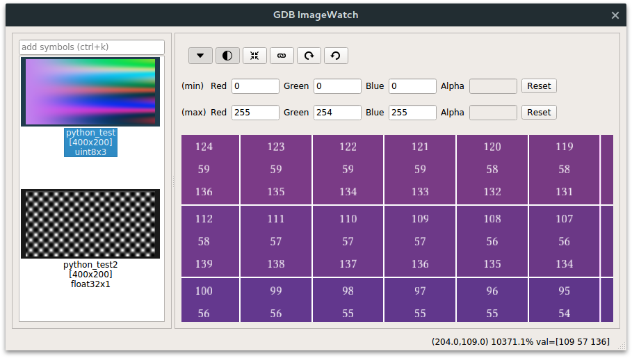

# Advanced GDB ImageWatch
GDB ImageWatch is a tool for visualizing in-memory buffers during debug
sessions using GDB. It works out of the box with instances of the OpenCV `Mat`
class, but can also be customized to work with any arbitrary data structure.



## Features

* GUI interactivity: Scroll to zoom, left click+drag to move the buffer around.
* Buffer values: Zoom in close enough to see the numerical values of the
  buffer.
* Auto update: Whenever a breakpoint is hit, the buffer view is automatically
  updated.
* Auto contrast: The entire range of values present in the buffer can be
  automatically mapped to the visualization range `[0, 1]`, where `0`
  represents black and `1` represents white.
* The contrast range can be manually adjusted, which is useful for inspecting
  buffers with extreme values (e.g. infinity, nan and other outliers).
* Link views together, moving all watched buffers simultaneously when any
  single buffer is moved on the screen
* Supported buffer types: uint8_t, int16_t, uint16_t, int32_t, uint32_t,
  float and double
* Supported buffer channels: Up to four channels (Grayscale, two-channels, RGB
  and RGBA)
* GPU accelerated
* Supports large buffers whose dimensions exceed GL_MAX_TEXTURE_SIZE.
* Supports data structures that map to a ROI of a larger buffer.
* Exports buffers as png images (with auto contrast) or octave/matlab matrix
  files (unprocessed).
* Rotate buffers 90&deg; clockwise or counterclockwise.
* Auto-load buffers being visualized in the previous debug session
* Designed to scale well for HighDPI displays

## Requirements

 * An OpenGL 2.1+ compliant GPU
 * A C++11 compliant compiler (gcc-5 or later is recommended)
 * GDB 7.10+ **compiled with python 3 support**
 * Qt 5.6+ (required due to the HighDPI display support - download it
   [here](https://info.qt.io/download-qt-for-application-development))
 * FreeType 2
 * Eigen 3
 * Python 3+ with its development packages
 * Numpy
 * GLEW with its development packages

## Installation

### Dependencies

On Ubuntu, you can install most of the dependencies with the following command:

    sudo apt-get install libpython3-dev libglew-dev python3-numpy python3-pip texinfo libfreetype6-dev libeigen3-dev
    sudo pip3 install pysigset

Download and install the latest version of GDB with python3 support (if you
already don't have it):

    wget http://ftp.gnu.org/gnu/gdb/gdb-7.10.tar.gz
    tar -zxvf gdb-7.10.tar.gz
    cd gdb-7.10
    ./configure --with-python=python3 --disable-werror
    make -j8

Notice that if you already have an older version of GDB, you will need to
either reconfigure your environment running `update-alternatives` or
reconfigure your IDE to use the updated version (which, by default, will be
installed on `/usr/local/bin/gdb`).

After the installation, you can remove both the file `gdb-7.10.tar.gz` and the
folder `gdb-7.10`.

Finally, clone the GDB ImageWatch plugin to any folder you prefer:

    git clone https://github.com/csantosbh/gdb-imagewatch

### Ubuntu 16.04 manual installation with QtCreator

Ubuntu 16.04 comes with qt4, which is not compatible with GDB ImageWatch. In
order to compile it, you need to install qt5
([get it here](https://info.qt.io/download-qt-for-application-development)) and
use its corresponding qmake during the compilation step.

If you are using QtCreator, you can change your Qt version under
Tools->Options->Build & Run->Kits, by setting Qt version to any Qt version >=
5.

### Build plugin and configure GDB

To build this plugin, create a `build` folder, open a terminal window inside it
and run:

    qmake .. BUILD_MODE=release PREFIX=/path/to/installation/folder
    make -j4
    make install

The installation step is optional; you can simply use the plugin from the build
folder instead. If you choose to install the plugin, it will be placed under
`/path/to/installation/folder/bin/gdb-imagewatch/`.

By default, the `PREFIX` variable is `/usr/local`.

#### Loading plugin: QtCreator

If you use QtCreator, the best way to integrate GDB ImageWatch into your
workflow is by using it as an *extra debugging helper*. This can be achieved by
going to the menu `Tools`->`Options`->`Debugger` and adding the file
`/path/to/gdb-imagewatch/gdb-imagewatch.py` in the option `Extra debugging
Helpers`.

This will automatically load the plugin for every debug session, and will
reload the local variables when switching between threads/stack level when the
debugger is paused.

#### Loading pugin: GDB/Other IDEs

If you are not using QtCreator, simply edit the `~/.gdbinit` file (create it if
it doesn't exist) and append the following line:

    source /path/to/gdb-imagewatch/gdb-imagewatch.py

This way, GDB will automatically load the GDB imagewatch plugin every time it
starts.

### Ubuntu 16.04 Automated Installation without QtCreator

If you are not using QtCreator, we provide the script `configure_ubuntu_16.sh`
which automates most of the installation of GDB ImageWatch on Ubuntu 16.04.
From the root directory of this project, execute the following:

    bash configure_ubuntu_16.sh

Follow this step with the instructions below in the section `Testing your
installation`.

## Testing your installation

After compiling the plugin, you can test it by opening a console in the
installation folder and running the following command from the root project
directory:

    python3 /path/to/gdb-imagewatch/gdb-imagewatch.py --test

If the installation was succesful, you should see the GDB ImageWatch window
with the same `sample_buffer_1` and `sample_buffer_2` buffers from the image on
the header of this page.

## Using plugin

When GDB hits a breakpoint, the GDB ImageWatch window will be opened. You only
need to type the name of the buffer to be watched in the "add symbols" input,
and press `<enter>`.

Alternatively, you can also invoke the GDB ImageWatch window directly from GDB
with the following command:

    plot variable_name

###  Auto-contrast and manual contrast

The (min) and (max) fields on top of the buffer view can be changed to control
autocontrast settings. By default, GDB ImageWatch will automatically fill these
fields with the mininum and maximum values inside the entire buffer, and the
channel values will be normalized from these values to the range [0, 1] inside
the renderer.

Sometimes, your buffer may contain trash, uninitialized values that are either
too large or too small, making the entire image look flat because of this
normalization. If you know the expected range for your image, you can manually
change the (min) and (max) values to focus on the range that you are
interested.

###  Locking buffers

Sometimes you want to compare two buffers being visualized, and need to zoom in
different places of these buffers. If they are large enough, this can become a
very hard task, especially if you are comparing pixel values. This task is made
easier by the `lock buffers` tool (which is toggled by the button with a chain
icon).

When it is activated, all buffers are moved/zoomed simultaneously by the same
amount. This means you only need to align the buffers being compared once;
after activating the `lock buffers` mode, you can zoom in anywhere you wish in
one buffer that all other buffers will be zoomed in the same location.

### Exporting bufers

Sometimes you may want to export your buffers to be able to process them in an
external tool. In order to do that, right click the thumbnail corresponding to
the buffer you wish to export on the left pane and select "export buffer".

GDB ImageWatch supports two export modes. You can save your buffer as a PNG
(which may result in loss of data if your buffer type is not `uint8_t`) or as a
binary file that can be opened with any tool.

### Loading Octave/Matlab buffers

Buffers exported in the `Octave matrix` format can be loaded with the function
`giw_load.m`, which is available in the `matlab` folder. To use it, add this
folder to Octave/Matlab `path` variable and call
`giw_load('/path/to/buffer.dump')`.

### Configure your IDE to use GDB 7.10

If you're not using gdb from the command line, make sure that your IDE is
correctly configured to use GDB 7.10. On QtCreator, go to
`Tools`->`Options`->`Build & Run`->`Debuggers` and make sure that the
configured path references a compatible GDB version.

## Basic configuration

The settings file for the plugin can be located under
`$HOME/.config/gdbimagewatch.ini`. You can change the following settings:

 * **Rendering**
    * *maximum_framerate* Determines the maximum framerate for the buffer
    rendering backend. Must be greater than 0.

## Advanced configuration

By default, the plugin works with OpenCV `Mat` structures, i.e. it assumes that
your buffer data structure has the following signature:

```cpp
struct Buffer {
    void* data;
    int cols; // Width
    int rows; // Height
    int flags; // OpenCV flags
    struct {
       int buf[2]; // Buf[0] = width of the containing
                   // buffer*channels; buff[1] = channels
    } step;
};
```

If you use a different buffer type, you need to adapt the file
`resources/giwscripts/giwtype.py` to your needs. This is actually pretty simple
and only involves editing the functions `get_buffer_info()` and
`is_symbol_observable()`.

The function `get_buffer_info()` must return a dictionary with the following
fields:

 * **display_name** Name of the buffer as it must appear in the ImageWatch
   window. Can be customized to also show its typename, for instance.
 * **pointer** Pointer to the buffer
 * **width**  Width of the ROI
 * **height** Height of the ROI
 * **channels** Number of color channels (Must be in the range `1 <= channels
   <= 3`)
 * **type** Identifier for the type of the underlying buffer. The supported
   values, defined under `resources/giwscripts/symbols.py`, are:
   * `GIW_TYPES_UINT8` = 0
   * `GIW_TYPES_UINT16` = 2
   * `GIW_TYPES_INT16` = 3
   * `GIW_TYPES_INT32` = 4
   * `GIW_TYPES_FLOAT32` = 5
   * `GIW_TYPES_FLOAT64` = 6

 * **row_stride** Number of pixels you have to skip in order to reach the pixel
   right below any arbitrary pixel. In other words, this can be thought of as
   the width, in pixels, of the underlying containing buffer. If the ROI is the
   total buffer size, this is the same of the buffer width.
 * **pixel_layout** String describing how internal channels should be ordered
   for display purposes. The default value for buffers of 3 and 4 channels is
   `'bgra'`, and `'rgba'` for images of 1 and 2 channels. This string must
   contain exactly four characters, and each one must be one of `'r'`, `'g'`,
   `'b'` or `'a'`.  Repeated channels, such as 'rrgg' are also valid.

The function `is_symbol_observable()` receives a gdb symbol and only returns
`True` if that symbol is of the observable type (the buffer you are dealing
with). By default, it works well with the `cv::Mat` type.

For more information on how to customize this file, check out this [more
detailed blog post](https://csantosbh.wordpress.com/2016/10/15/configuring-gdb-imagewatch-to-visualize-custom-buffer-types/).

## Features for the Future & Known issues

* Buffers are currently exported preserving the auto-contrast settings; they
  should not preserve auto-contrast (when saving in octave format) or only do
  it if auto-contrast is enabled (png)
