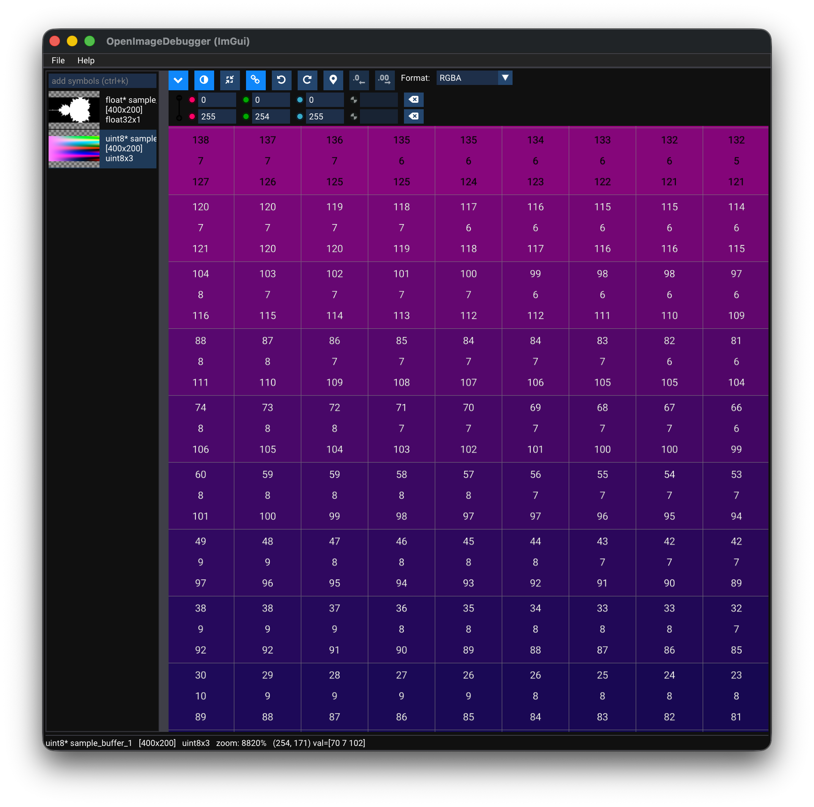

# Open Image Debugger: Enabling visualization of in-memory buffers on GDB/LLDB

[](https://marketplace.visualstudio.com/items?itemName=OpenImageDebugger.openimagedebugger-vscode)
[](https://open-vsx.org/extension/openimagedebugger/openimagedebugger-vscode)

Open Image Debugger is a tool for visualizing in-memory buffers during debug
sessions, compatible with both GDB and LLDB. It works out of the box with
instances of the OpenCV `Mat` class and `Eigen` matrices, but can also be
customized to work with any arbitrary data structure.



> **Prefer VS Code or a fork (Cursor, VSCodium, Windsurf, …)?** Skip the manual
> build — install the extension from the
> [VS Code Marketplace](https://marketplace.visualstudio.com/items?itemName=OpenImageDebugger.openimagedebugger-vscode)
> or [Open VSX](https://open-vsx.org/extension/openimagedebugger/openimagedebugger-vscode).
> See [Installation](#vs-code-and-forks) below.

> **New — declarative custom types.** You can now describe your own buffer types
> in a `.oid/types.json` file instead of writing Python; the same file works in
> gdb, lldb, and the VS Code extension. See
> [doc/declarative-types.md](doc/declarative-types.md).

# Download (experimental) [](https://tooomm.github.io/github-release-stats/?username=OpenImageDebugger&repository=OpenImageDebugger&search=0)
## A bit experimental, better to compile manually

## Features

* GUI interactivity:
  * Scroll to zoom, left click+drag to move the buffer around;
  * Rotate buffers 90&deg; clockwise or counterclockwise;
  * Go-to widget that quickly takes you to any arbitrary pixel location;
* Buffer values: Zoom in close enough to inspect the numerical contents of any pixel.
* Auto update: Whenever a breakpoint is hit, the buffer view is automatically
  updated.
* Auto contrast: The entire range of values present in the buffer can be
  automatically mapped to the visualization range `[0, 1]`, where `0`
  represents black and `1` represents white.
* The contrast range can be manually adjusted, which is useful for inspecting
  buffers with extreme values (e.g. infinity, nan and other outliers).
* Link views together, moving all watched buffers simultaneously when any
  single buffer is moved on the screen
* Supported buffer types: uint8_t, int16_t, uint16_t, int32_t, uint32_t,
  float and double
* Supported buffer channels: Up to four channels (Grayscale, two-channels, RGB
  and RGBA)
* GPU accelerated
* Supports large buffers whose dimensions exceed GL_MAX_TEXTURE_SIZE.
* Supports data structures that map to a ROI of a larger buffer.
* Exports buffers as png images (with auto contrast) or octave/matlab matrix
  files (unprocessed).
* Auto-load buffers being visualized in the previous debug session
* Designed to scale well for HighDPI displays
* Works on Linux, macOS X and Windows (experimental)

## Supported OSes

* OID is developed with Ubuntu as the main target. The goal is to support the two latest LTS versions at a given time.
  * Ubuntu is also used as a basis for the minimum versions of the dependencies: we try to support the default versions of the packages you get via `apt install`
* There are currently no plans to support other Linux distros. OID may or may not compile on your favorite distro, your mileage may vary.
* Support for MacOS and Windows are somewhat experimental now - the code should be able to compile (see <https://github.com/OpenImageDebugger/OpenImageDebugger/releases>), but the binaries are not actively tested - in fact we currently have no automated tests at all for any OS - help is more than welcome in this regard. Also, we haven't come up with a simple installation/usage guides for these OSes yet.

## Requirements

* A C++20 compliant compiler
* GDB **15.0.50+** or LLDB **18.1.3+**
* CMake **3.28.3+**
* Python **3.12.3+** development packages
* OpenGL **2.1+** support
* Linux only: Wayland and X11 development packages (needed to build the bundled GLFW) and GTK 3 development packages (needed by the native file-open dialog); see the `apt install` command below. Alternatively, configure with `-DNFD_PORTAL=ON` to use the xdg-desktop-portal (D-Bus) dialog backend instead of GTK.

All other third-party libraries are bundled as git submodules and built from source, so they don't need to be installed:

* [Dear ImGui](https://github.com/ocornut/imgui) — viewer UI
* [GLFW](https://github.com/glfw/glfw) — window and OpenGL context management
* [Eigen](https://gitlab.com/libeigen/eigen) — linear algebra for the visualization layer
* [Asio](https://github.com/chriskohlhoff/asio) (standalone) — IPC between the debugger bridge and the viewer
* [nlohmann/json](https://github.com/nlohmann/json) — settings persistence
* [stb](https://github.com/nothings/stb) — image decoding for opening files, plus PNG export and text rendering (`stb_image`, `stb_image_write`, `stb_truetype`)
* [nanosvg](https://github.com/memononen/nanosvg) — toolbar icon rasterization
* [nativefiledialog-extended](https://github.com/btzy/nativefiledialog-extended) — native OS dialog for File → Open (native builds only)
* [GoogleTest](https://github.com/google/googletest) — unit tests

Note: this list might get out-of-date by accident. For a more accurate list of requirements, please check what is used in <https://github.com/OpenImageDebugger/OpenImageDebugger/blob/main/.github/workflows/build.yml> and in the CI container images defined in <https://github.com/OpenImageDebugger/dockerfiles>.

## Installation

### VS Code and forks

The quickest way to get started is the Open Image Debugger extension, available for
VS Code and compatible forks (Cursor, VSCodium, Windsurf, and others):

* [VS Code Marketplace](https://marketplace.visualstudio.com/items?itemName=OpenImageDebugger.openimagedebugger-vscode)
* [Open VSX](https://open-vsx.org/extension/openimagedebugger/openimagedebugger-vscode)

If you'd rather build and integrate the desktop version manually, follow the steps below.

### Ubuntu Linux dependencies

On Ubuntu, you can install most of the dependencies with the following command:

```bash
sudo apt install build-essential cmake libgl1-mesa-dev libgtk-3-dev libpython3-dev \
    python3-dev libwayland-dev libxcursor-dev libxi-dev libxinerama-dev \
    libxkbcommon-dev libxrandr-dev pkg-config
```

### Building the Open Image Debugger

Clone the source code to any folder you prefer and initialize the
submodules:

```bash
git clone https://github.com/OpenImageDebugger/OpenImageDebugger.git --recurse-submodules
```

Now run the following commands to build it:

```bash
cmake -S . -B build -DCMAKE_INSTALL_PREFIX=/path/to/installation/folder
cmake --build build --config Release --target install -j 4
```

**GDB integration:** Edit the file `~/.gdbinit` (create it if it doesn't exist)
and append the following line:

```bash
source /path/to/OpenImageDebugger/oid.py
```

**LLDB integration:** Edit the file `~/.lldbinit` (create it if it doesn't
exist) and append the following line:

```bash
command script import /path/to/OpenImageDebugger/oid.py
```

### MacOS Installation

At the moment, the MacOS build is only known to work with `python3` and `lldb`
installed from [Homebrew](https://brew.sh/) (the system-provided LLDB from the
Xcode Command Line Tools is not supported). Install them with:

```bash
brew install python3 llvm
```

Make sure `python3` resolves to the Homebrew one — run `which python3` and
confirm it points under the Homebrew prefix (`/opt/homebrew` on Apple Silicon,
`/usr/local` on Intel; `brew --prefix` prints it), rather than a pyenv, conda or
system Python. The standard Homebrew install puts that prefix's `bin` on your
`PATH`.

Then debug your program using the Homebrew LLDB, for example:

```bash
BREW_PREFIX=$(brew --prefix)
"$BREW_PREFIX"/opt/llvm/bin/lldb /path/to/your/executable
```

### Testing your installation

After compiling the plugin, you can test it by running the following command
(use the same Python 3 interpreter CMake found when building):

```bash
python3 /path/to/OpenImageDebugger/oid.py --test
```

On MacOS, invoke the test with the full path to the Homebrew `python3`, for
example:

```bash
BREW_PREFIX=$(brew --prefix)
"$BREW_PREFIX"/bin/python3 /path/to/OpenImageDebugger/oid.py --test
```

If the installation was succesful, you should see the Open Image Debugger window
with the buffers `sample_buffer_1` and `sample_buffer_2`.

## Using plugin

When the debugger hits a breakpoint, the Open Image Debugger window will be
opened. You only need to type the name of the buffer to be watched in the
"add symbols" input, and press `<enter>`.

### Opening image files directly

You can also open an image or NumPy array in the viewer without a debugger
session at all, either from the **File → Open** menu (shortcut `Ctrl+O`) or
from the command line.

From the command line, pass one or more files with the repeatable `-o` /
`--open` flag:

```bash
oidwindow --open path/to/image.png --open path/to/array.npy
```

Supported formats:

| Category | Extensions |
| --- | --- |
| Images (via stb_image) | `png`, `jpg`/`jpeg`, `bmp`, `tga`, `gif`, `psd`, `hdr`, `ppm`/`pgm`/`pnm` |
| NumPy arrays | `npy` (little-endian `uint8`/`uint16`/`int16`/`int32`/`float32`/`float64`; 2-D grayscale or 3-D with 1&ndash;4 channels) |

Files opened this way are shown alongside any debugger buffers, but they are
never reported back to a debugger and are not saved as session state.

> **Linux build note:** the native file dialog requires GTK 3
> (`libgtk-3-dev`) at build time, or configure with `-DNFD_PORTAL=ON` to use
> the xdg-desktop-portal (D-Bus) backend instead. MacOS and Windows need no
> extra packages.

Open Image Debugger does not register itself as a system handler for these
file types; use the **File → Open** menu or the `--open` flag to load them.

###  Auto-contrast and manual contrast

The (min) and (max) fields on top of the buffer view can be changed to control
autocontrast settings. By default, Open Image Debugger will automatically fill these
fields with the mininum and maximum values inside the entire buffer, and the
channel values will be normalized from these values to the range [0, 1] inside
the renderer.

Sometimes, your buffer may contain trash, uninitialized values that are either
too large or too small, making the entire image look flat because of this
normalization. If you know the expected range for your image, you can manually
change the (min) and (max) values to focus on the range that you are
interested.

###  Locking buffers

Sometimes you want to compare two buffers being visualized, and need to zoom in
different places of these buffers. If they are large enough, this can become a
very hard task, especially if you are comparing pixel values. This task is made
easier by the `lock buffers` tool (which is toggled by the button with a chain
icon).

When it is activated, all buffers are moved/zoomed simultaneously by the same
amount. This means you only need to align the buffers being compared once;
after activating the `lock buffers` mode, you can zoom in anywhere you wish in
one buffer that all other buffers will be zoomed in the same location.

###  Quickly moving to arbitrary coordinates

If you need to quickly move to any pixel location, then the *go to*
functionality is what you are looking for. Press *Ctrl+L* and two input fields
corresponding to the target destination in format `<x, y>` will appear at the
bottom right corner of the buffer screen. Type the desired location, then press
enter to quickly zoom into that location.

### Exporting bufers

Sometimes you may want to export your buffers to be able to process them in an
external tool. In order to do that, right click the thumbnail corresponding to
the buffer you wish to export on the left pane and select "export buffer".

Open Image Debugger supports two export modes. You can save your buffer as a PNG
(which may result in loss of data if your buffer type is not `uint8_t`) or as a
binary file that can be opened with any tool.

### Loading exported buffers on Octave/Matlab

Buffers exported in the `Octave matrix` format can be loaded with the function
`oid_load.m`, which is available in the `matlab` folder. To use it, add this
folder to Octave/Matlab `path` variable and call
`oid_load('/path/to/buffer.dump')`.

### AI agent access (MCP, experimental)

Open Image Debugger ships an experimental **MCP server** (`oid-mcp`) that
lets AI coding agents inspect your buffers in a live gdb/lldb session —
list observable symbols at a breakpoint, view renderings, read exact
values, dump lossless `.npy` copies, and mirror buffers into the viewer.
Agents can also control and read back a running viewer's view — pan,
zoom, rotate, channel, and auto-contrast — including one opened
standalone with no debugger attached. It is opt-in (launch the debugger
with `OID_AGENT=1`) and exposes debuggee memory to local processes, so
enable it only in trusted, local development.

See [`resources/oidmcp/README.md`](resources/oidmcp/README.md) for
deployment and usage instructions.

## Basic configuration

The settings file for the plugin can be located under
`$HOME/.config/OpenImageDebugger.ini`. You can change the following settings:

* **Rendering**
  * *maximum_framerate* Determines the maximum framerate for the buffer
  rendering backend. Must be greater than 0.
* **UI** - thanks to @a-hromov for the contribution
  * *list_position* Determines the position of symbols list.
    * `left` Default value.
    * `right`
    * `top`
    * `bottom`
  * *minmax_compact* Changes the position of min/max intensity controller.
    * `true` Places min/max intensity controller in the same row with the toolbar.
    * `false` Places min/max intensity controller below the toolbar. Default value.
  * *colorspace* Selects the order of colorspace channels on the UI.
    * `rgba` Default value.
    * `bgra`

## Advanced configuration

By default, the plugin works with several data types, including OpenCV's `Mat`,
`CvMat` and `IplImage` and Eigen's `Matrix` and `Map`.

Supported library versions: OpenCV 2–5 and Eigen 3.x. The OpenCV
`Mat`/`CvMat` channel count is read from the type-flag bit packing in a
version-adaptive way, so both the pre-5 and the OpenCV 5 layouts resolve
correctly; `CvMat` and `IplImage` are the legacy C API and therefore apply
only to OpenCV builds that still expose it (4.x and earlier).

### Custom types (recommended): declarative JSON

To support a different buffer type, describe it in a `.oid/types.json` file at
your workspace root — no Python required. The common case is five fields:

```json
{
  "version": 1,
  "types": [
    { "match": "^MyImage$",
      "pointer": "{sym}.data",
      "width": "{sym}.w",
      "height": "{sym}.h",
      "dtype": "float32" }
  ]
}
```

The same file is read by gdb, lldb, and the VS Code extension. You can also
point OID at files outside the workspace with the `OID_TYPES_PATH` environment
variable. The full format — every field, the expression grammar, dtype names,
discovery and precedence, and a walkthrough migrating an existing Python
inspector — is documented in
[doc/declarative-types.md](doc/declarative-types.md), and the built-in types in
`resources/oidscripts/oidtypes/builtin_types.json` double as a worked-example
gallery.

### Custom types (legacy): Python inspectors

The original Python path is still supported for cases the declarative format
cannot express, but it is no longer the preferred approach for new types.
Implement a `TypeInspectorInterface` subclass from
`resources/oidscripts/oidtypes/interface.py`; see
[doc/python-inspectors.md](doc/python-inspectors.md) for the full instructions —
the interface methods, the buffer-metadata dictionary contract, and the debug
decorators.
