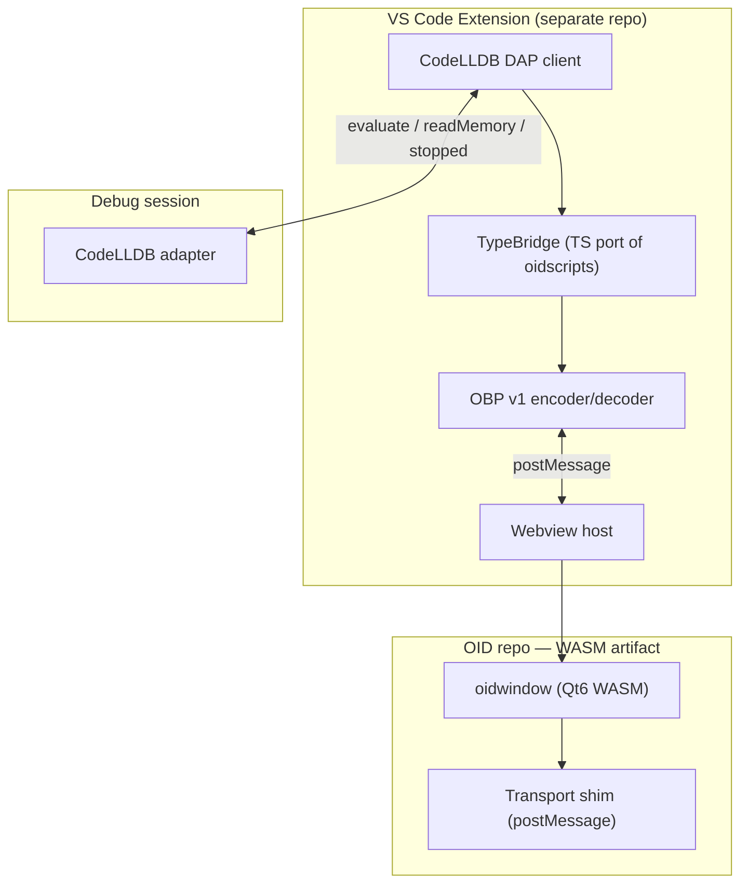
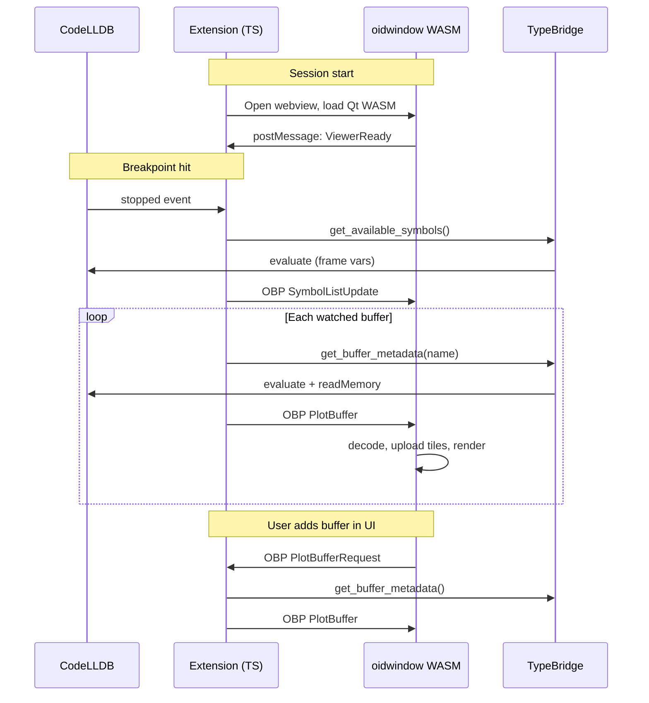

# OID WASM viewer + VS Code extension

**Date:** 2026-06-23  
**Status:** Approved for implementation  
**Goal:** Ship full feature parity with desktop Open Image Debugger inside VS Code on macOS and Linux, by compiling `oidwindow` to Qt6 WebAssembly and replacing the GDB/LLDB Python bridge with a TypeScript extension that talks to CodeLLDB via DAP.

---

## 1. Decisions

| Topic | Choice |
|-------|--------|
| Scope | Full parity with desktop OID |
| Debugger | CodeLLDB only (DAP) |
| Viewer | Qt6 for WebAssembly (`oidwindow` port) |
| Bridge | TypeScript in the extension (port `oidscripts`) |
| Platforms (v1) | macOS + Linux |
| Repository layout | Separate extension repo; WASM published as npm artifact from OID repo |
| Recommended approach | Published WASM artifact + `ITransport` abstraction (Approach 1) |

### Approaches considered

1. **Published WASM artifact + transport abstraction (chosen)** — OID repo builds and publishes `@openimagedebugger/viewer-wasm`; extension is pure TypeScript; OBP v1 is the sole wire format; `ITransport` abstracts TCP vs postMessage.
2. **Extension-owned WASM build** — Extension CI builds OID from a pinned source tag. Rejected: duplicates build tooling; WASM fixes still require OID upstream changes.
3. **Passive WASM viewer** — Extension owns all orchestration; WASM only renders. Rejected: diverges from full parity goal and requires large `oidwindow` refactor.

---

## 2. Architecture



### Role split

| Component today | WASM + VS Code equivalent | Repo |
|-----------------|---------------------------|------|
| `oidscripts` (Python) | TypeScript extension (`codelldb-bridge`, `typebridge`) | Extension |
| `oidbridge` (C++) | Extension orchestration (no process spawn) | Extension |
| `oidwindow` (Qt desktop) | `oidwindow` (Qt6 WASM) | OID → npm |
| TCP + legacy IPC | OBP v1 `Envelope` over `postMessage` | Both |
| GDB/LLDB Python APIs | CodeLLDB DAP | Extension |

Desktop OID (GDB/LLDB Python path) remains unchanged for v1. WASM is an additional build target.

---

## 3. Data flow and buffer lifecycle



### Stop handler

Port of `OpenImageDebuggerEvents.stop_handler`:

1. Ensure webview is open and WASM reports ready.
2. For each observed buffer: fetch metadata + pixel data, send `PlotBuffer`.
3. Refresh symbol autocomplete list via `SymbolListUpdate`.

### Buffer fetch

Port of `get_buffer_metadata` + `serialize_plot_buffer`:

- TypeBridge resolves the variable expression via CodeLLDB `evaluate`.
- Reads raw bytes via DAP `readMemory` using `memoryReference` from the evaluate result.
- Extension tiles large buffers per `BufferPayload` in `docs/protocol/obp/v1/buffer.proto`.
- Sends a single `PlotBuffer` envelope to WASM.

### Event loop

Desktop polls `oid_run_event_loop` at ~30 Hz for UI→bridge messages. In WASM, inbound `postMessage` events drive the same `MessageHandler` code path. No polling loop is required in the extension.

### Session persistence

Extension reads/writes `SessionState` proto to VS Code `globalState` / workspace storage. On WASM ready, push a `SessionState` envelope to restore watched buffers, contrast, link-views, and related UI state.

---

## 4. OBP protocol completion

Legacy `MessageComposer` / `MessageDecoder` over TCP must be fully replaced by OBP v1 for the WASM path. Desktop may migrate in parallel.

| Legacy message | OBP v1 equivalent | Status |
|----------------|-------------------|--------|
| `PlotBufferContents` | `Envelope.plot_buffer` | Done |
| `SetAvailableSymbols` | `Envelope.symbol_list` | Proto exists |
| `GetObservedSymbols` / response | `Envelope.session_state` | Proto exists; map watched buffer list |
| `PlotBufferRequest` (UI→bridge) | `Envelope.plot_buffer_request` | **New — add to proto** |
| Export PNG / Octave | `Envelope.export_request` / `export_result` | Proto exists; WASM requests export, extension writes file |

### Proto addition (`docs/protocol/obp/v1/control.proto`)

```protobuf
message PlotBufferRequest {
  string variable_name = 1;
}

// Add to Envelope.oneof body:
//   PlotBufferRequest plot_buffer_request = 18;
```

### postMessage framing

```typescript
interface OidMessage {
  type: 'obp';
  sequence: number;
  payload: Uint8Array;  // serialized Envelope
}
```

Both sides use `sequence` for request/response pairing. Tile large `PlotBuffer` payloads before hitting practical postMessage size limits (~64 MB).

---

## 5. OID repo changes

### Transport abstraction

Introduce `src/ipc/transport.h`:

```cpp
class ITransport {
 public:
  virtual void send(std::span<const std::byte> data) = 0;
  virtual bool receive(std::vector<std::byte>& out) = 0;
};
// TcpTransport (desktop) | PostMessageTransport (emscripten)
```

Refactor `MessageComposer`, `MessageDecoder`, and `MessageHandler` to use `ITransport*` instead of `QTcpSocket*`.

### WASM build target

New CMake target `oidwindow_wasm` (or conditional on `CMAKE_SYSTEM_NAME STREQUAL "Emscripten"`):

- Requires Qt 6.x WASM kit + Emscripten 3.x.
- Compile definition: `OID_TRANSPORT_POSTMESSAGE`.
- `PostMessageTransport` uses `EM_ASM` to call `window.oidSend` / receive via `window.oidOnMessage`.
- WASM `main()`: no TCP connect; signal ready to extension via postMessage handshake.

### Artifact publishing

OID CI builds and publishes npm package `@openimagedebugger/viewer-wasm@<oid-version>` containing:

- `oidwindow.wasm`, `oidwindow.js`, Qt runtime files, `loader.html`
- `protocol_version` compatibility metadata

Extension pins this package version to OID releases.

---

## 6. VS Code extension (separate repo)

**Repository name (proposed):** `openimagedebugger-vscode`

```
openimagedebugger-vscode/
├── package.json
├── src/
│   ├── extension.ts
│   ├── debugger/
│   │   ├── codelldb-bridge.ts    # BridgeInterface impl
│   │   └── dap-client.ts
│   ├── typebridge/
│   │   ├── index.ts
│   │   ├── opencv-mat.ts
│   │   └── eigen-matrix.ts
│   ├── obp/                      # protoc-generated TS from OID protos
│   ├── session/
│   │   ├── session-manager.ts
│   │   └── persistence.ts
│   └── webview/
│       ├── panel.ts
│       └── loader.html
├── media/                        # from @openimagedebugger/viewer-wasm
└── test/
```

### Activation

- `onDebug` with debugger type `lldb` (CodeLLDB).
- Track `stopped`, `terminated`, and thread/frame changes via `DebugAdapterTracker` or debug session events.

### Commands

| Command | Purpose |
|---------|---------|
| `oid.plot` | Plot variable under cursor (port GDB/LLDB `plot` command) |
| `oid.openPanel` | Open or focus viewer webview panel |
| `oid.export` | Trigger export; WASM sends `ExportRequest`, extension writes file |

### TypeBridge port

| Python source | TypeScript target | DAP API |
|---------------|-------------------|---------|
| `lldbbridge.get_buffer_metadata` | `codelldb-bridge.ts` | `evaluate` + `readMemory` |
| `typebridge.TypeBridge` | `typebridge/index.ts` | LLDB type info via evaluate |
| OpenCV `Mat` parser | `opencv-mat.ts` | `data`, `step`, dims via evaluate |
| Eigen matrix parser | `eigen-matrix.ts` | same pattern |
| Custom types (`oidtypes/`) | workspace settings or TS plugins | user-provided |

`queue_request` from `BridgeInterface` serializes work on the extension main thread. CodeLLDB DAP is async-safe (unlike GDB).

---

## 7. Error handling

| Failure | Behavior |
|---------|----------|
| WASM fails to load | Webview error panel with OID version and requirements |
| OBP version mismatch | Refuse connection; prompt to update extension or WASM package |
| Variable not plottable | `Envelope.error` to WASM; status bar notification |
| `readMemory` fails | Retry once; then error with variable name |
| Debug session ends | Exit signal; close or disable panel |
| Buffer exceeds GL texture limit | Tile via existing `BufferPayload` logic |

---

## 8. Testing

### OID repo

- Unit tests: `PostMessageTransport` + OBP round-trip (extend `docs/protocol/obp/v1/conformance/`).
- WASM smoke test: headless Playwright loads wasm, sends sample `PlotBuffer`, asserts no crash.
- Desktop regression suite unchanged.

### Extension repo

- Unit tests: TypeBridge with mocked DAP fixture JSON from real LLDB sessions.
- Integration test: CodeLLDB on `testbench/` binary, breakpoint hit, assert `PlotBuffer` received.
- Manual matrix: macOS + Linux; OpenCV `Mat` + raw buffer types.

---

## 9. Delivery phases

| Phase | Deliverable | Parity checkpoint |
|-------|-------------|-------------------|
| P0 | `ITransport` abstraction + `PlotBufferRequest` proto | Infrastructure |
| P1 | WASM builds; loads in webview; renders test `PlotBuffer` | Rendering |
| P2 | Extension + CodeLLDB stop → plot one OpenCV `Mat` | Core loop |
| P3 | Symbol list, watched buffers, auto-update on stop | Session management |
| P4 | Auto-contrast, rotation, go-to, pixel values, link views | UI features |
| P5 | Export PNG/Octave, session persistence, Eigen + custom types | Full parity |
| P6 | Marketplace publish, user documentation | Ship |

---

## 10. Success criteria

- User can debug a C++ app with CodeLLDB in VS Code on macOS or Linux, hit a breakpoint, and plot an OpenCV `Mat` with the same core interactions as desktop OID (zoom, pan, contrast, pixel values).
- WASM viewer artifact version is pinned and compatible with the extension via OBP `protocol_version`.
- Desktop GDB/LLDB workflow is not regressed.
- Extension installs from `.vsix` or VS Code Marketplace without native OID binaries (only the WASM npm package bundled in the extension).

---

## Self-review (spec)

- **Placeholder scan:** No TBD sections. All requirements are explicit.
- **Internal consistency:** Architecture, data flow, proto additions, and delivery phases align. Extension owns bridge; OID owns viewer WASM.
- **Scope check:** Single implementation plan scope. Extension repo creation is noted but implementation plan for OID repo changes is the first deliverable.
- **Ambiguity check:** v1 platforms are macOS + Linux only. Full parity is the P6 target, not P2. Export file writes are handled by the extension host, not WASM filesystem.
