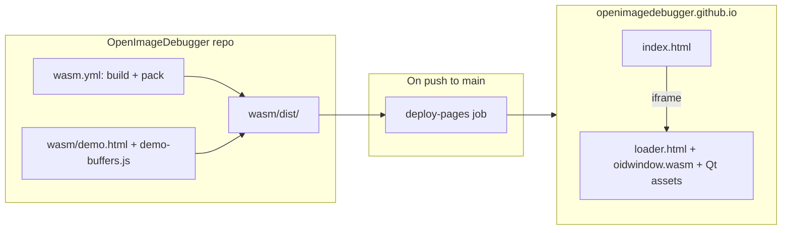

# OID WASM GitHub Pages demo

**Date:** 2026-06-24  
**Status:** Approved for implementation  
**Goal:** Publish a public auto-play demo of the OID Qt WASM viewer at `https://openimagedebugger.github.io/`, plotting the same two sample buffers used by `oid.py --test` (`resources/oidscripts/test.py`).

---

## 1. Decisions

| Topic | Choice |
|-------|--------|
| Demo buffers | `sample_buffer_1` (uint8 RGB waves) + `sample_buffer_2` (float Mandelbrot) from `test.py` |
| Dimensions | 400 × 200 (matches `DummyDebugger` defaults) |
| Hosting | Organization site: `https://openimagedebugger.github.io/` |
| Org-site repo | `OpenImageDebugger/openimagedebugger.github.io` (static files only) |
| Deploy trigger | OID `main` CI pushes packed `wasm/dist` after successful WASM build |
| UX | Auto-play on load (no user interaction required) |
| Recommended approach | Demo shell in OID repo, CI publishes full dist (Approach 1) |

### Approaches considered

1. **Demo shell in OID repo, CI publishes full `wasm/dist` (chosen)** — Single source of truth; local `serve-wasm.sh` matches production; org repo is a dumb static host.
2. **Demo page only in org repo** — OID CI pushes WASM binaries only; org repo owns HTML/JS. Rejected: two repos to keep in sync; wire-format drift risk.
3. **Precomputed binary fixtures** — Commit golden `PlotBufferContents` blobs. Rejected: opaque; breaks when protocol or dimensions change; harder to verify parity with `test.py`.

---

## 2. Architecture



### Runtime flow (auto-play)

1. `index.html` loads `loader.html` in a full-page iframe.
2. Qt WASM boots; viewer emits `viewer-ready` via `postMessage`.
3. Host waits 300 ms (same as `test-harness.html`), then sends:
   - `SetAvailableSymbols` with `['sample_buffer_1', 'sample_buffer_2']`
   - `PlotBufferContents` for `sample_buffer_1`
   - `PlotBufferContents` for `sample_buffer_2`
4. Status bar shows “Demo loaded”.

### Payload sizes

| Buffer | Raw size | Notes |
|--------|----------|-------|
| `sample_buffer_1` | 240 KB | 400 × 200 × 3 × uint8 |
| `sample_buffer_2` | 320 KB | 400 × 200 × 1 × float32 |

Total ~560 KB — well under Chromium `postMessage` limits (~64 MB).

### Wire format

Same as existing WASM smoke test (`wasm/test-harness.html`):

- wasm32 `u32` little-endian length prefixes for strings and pixel spans
- `PlotBufferContents` field order per `oid_bridge.cpp::plot_buffer` (see `docs/superpowers/specs/2026-06-24-oid-wasm-vscode-qt611-design.md` §3)
- `postMessage` envelope: `{ type: 'oid-ipc', payload: Uint8Array }`
- Control plane: `{ type: 'oid-control', event: 'viewer-ready', … }`

No OID C++ or protocol changes required.

---

## 3. Components and files

### OID repo (source)

| File | Purpose |
|------|---------|
| `wasm/demo-buffers.js` | ES module: port of `test.py` `_gen_color` + `_gen_buffers(400, 200)` |
| `wasm/demo.html` | Demo shell: status bar, iframe → `loader.html`, IPC encoders, auto-play |
| `wasm/loader.html` | Unchanged — Qt WASM bootstrap + `postMessage` bridge |
| `wasm/test-harness.html` | Unchanged — local 2×2 smoke test |
| `wasm/scripts/pack-viewer-wasm.sh` | Also copies `demo.html` → `dist/index.html`, `demo-buffers.js` → `dist/` |
| `.github/workflows/wasm.yml` | Add `deploy-pages` job (main only) |

### Org repo (`openimagedebugger.github.io`)

Flat static tree at repo root — no build step:

```
index.html
demo-buffers.js
loader.html
oidwindow.wasm
oidwindow.js
qtloader.js
qt*.js / qt*.wasm
version.json
```

### `demo-buffers.js` — parity with `test.py`

Exports `genBuffers(width, height)` returning metadata + pixel bytes for both buffers.

| Field | `sample_buffer_1` | `sample_buffer_2` |
|-------|-------------------|-------------------|
| `variable_name` | `sample_buffer_1` | `sample_buffer_2` |
| `display_name` | `uint8* sample_buffer_1` | `float* sample_buffer_2` |
| `width` / `height` | 400 / 200 | 400 / 200 |
| `channels` | 3 | 1 |
| `bufferType` | 0 (`OID_TYPES_UINT8`) | 5 (`OID_TYPES_FLOAT32`) |
| `pixel_layout` | `rgba` | `rgba` |
| `stride` | 400 | 400 |
| `transpose` | false | false |

Generation logic (direct port of `resources/oidscripts/test.py`):

- **Buffer 1:** `_gen_color(pos, k, f_a, f_b)` per channel using `Math.cos` / `Math.sin`; truncate to `uint8` like Python `[int(val) for val in tex1]`.
- **Buffer 2:** Mandelbrot with 20 iterations, `z_threshold = 5.0`, `c_x = width * 2/3`, `c_y = height * 0.5`, `scale = 3.0 / width`; encode floats as little-endian `Float32Array`.

### `demo.html` IPC helpers

Shared with `test-harness.html` pattern:

- `pushU32`, `pushI32`, `pushString`
- `buildPlotBufferContents(params)` — type `3`
- `buildSetAvailableSymbols(names)` — type `2`, count + length-prefixed names

### Page chrome

Minimal dark status bar (matching `test-harness.html`):

- “Loading viewer…” → “Sending demo buffers…” → “Demo loaded” (green)
- Errors in red (iframe load fail, WASM crash, generation error, 60 s ready timeout)

No marketing copy in v1 — the OID viewer UI is the demo.

---

## 4. CI deploy

Extend `.github/workflows/wasm.yml` with a `deploy-pages` job:

```yaml
deploy-pages:
  needs: wasm
  if: github.event_name == 'push' && github.ref == 'refs/heads/main'
  runs-on: ubuntu-24.04
  permissions:
    contents: read
  steps:
    - uses: actions/checkout@v4
    - uses: actions/download-artifact@v4
      with:
        name: viewer-wasm
        path: wasm/dist
    - uses: peaceiris/actions-gh-pages@v4
      with:
        deploy_key: ${{ secrets.OID_PAGES_DEPLOY_KEY }}
        external_repository: OpenImageDebugger/openimagedebugger.github.io
        publish_dir: wasm/dist
        publish_branch: main
        commit_message: "deploy: OID WASM demo (${{ github.sha }})"
```

PRs and `workflow_dispatch` continue to build and upload the artifact; they do **not** deploy.

### One-time manual setup

1. Create `OpenImageDebugger/openimagedebugger.github.io` with an empty `main` branch.
2. Enable GitHub Pages: source = `main` branch, root `/`.
3. Generate an SSH deploy key pair.
4. Add the **private** key as `OID_PAGES_DEPLOY_KEY` in OID repo secrets.
5. Add the **public** key as a deploy key (write access) on the org-site repo.

---

## 5. Error handling

| Failure | User-visible behavior |
|---------|----------------------|
| iframe fails to load | “Failed to load viewer” (red) |
| WASM init throws | Qt loader error in status bar |
| `viewer-ready` never arrives | After 60 s: “Viewer did not become ready” |
| Buffer generation throws | Error in status bar; no IPC sent |
| Deploy job fails | OID `main` CI red; live site unchanged |

No client-side retry in v1 — page refresh is sufficient.

---

## 6. Testing

| Layer | What | How |
|-------|------|-----|
| Buffer parity | JS matches Python at 400×200 | Node test: `demo-buffers.js` checksums vs golden hashes from `test.py` |
| Local smoke | Full demo | `build-wasm.sh && pack-viewer-wasm.sh && serve-wasm.sh` → `http://localhost:8765/` |
| CI build | WASM compiles | Existing `wasm` job |
| Post-deploy | Live site | Manual check after first deploy; optional future Playwright against org URL |

---

## 7. Out of scope (v1)

- Animated or live-updating buffers
- CodeLLDB / VS Code integration on the demo page
- Custom domain or landing-page marketing copy
- Deploy on release tags only (every `main` merge deploys)
- COOP/COEP headers (not required for single-thread Qt WASM)
- Chunking large buffers (not needed at 400×200)

---

## 8. Self-review checklist

- [x] No TBD / TODO placeholders
- [x] Architecture matches component descriptions and deploy flow
- [x] Scope fits a single implementation plan (OID repo changes + org-repo bootstrap docs)
- [x] Buffer metadata explicitly pinned to `test.py` at 400×200
- [x] Deploy only on `main` push; PRs build-only
