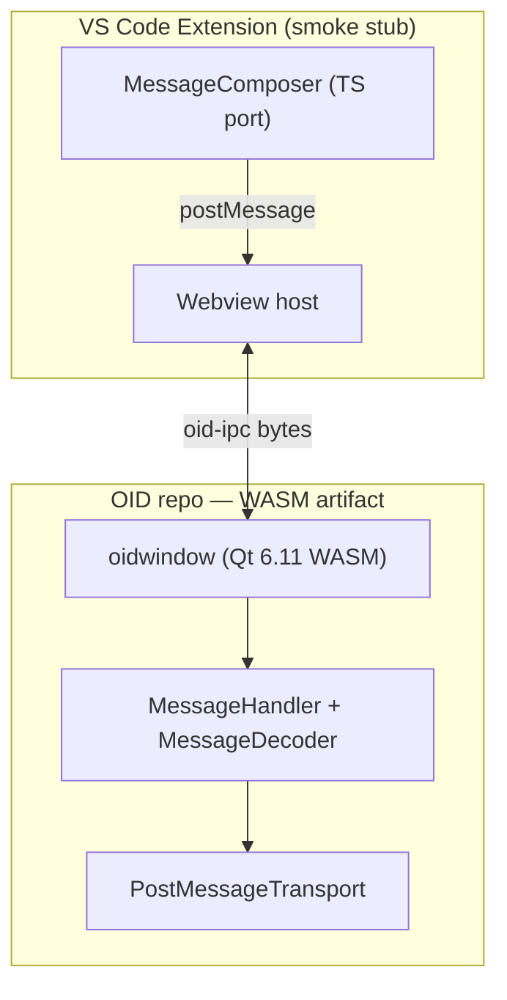
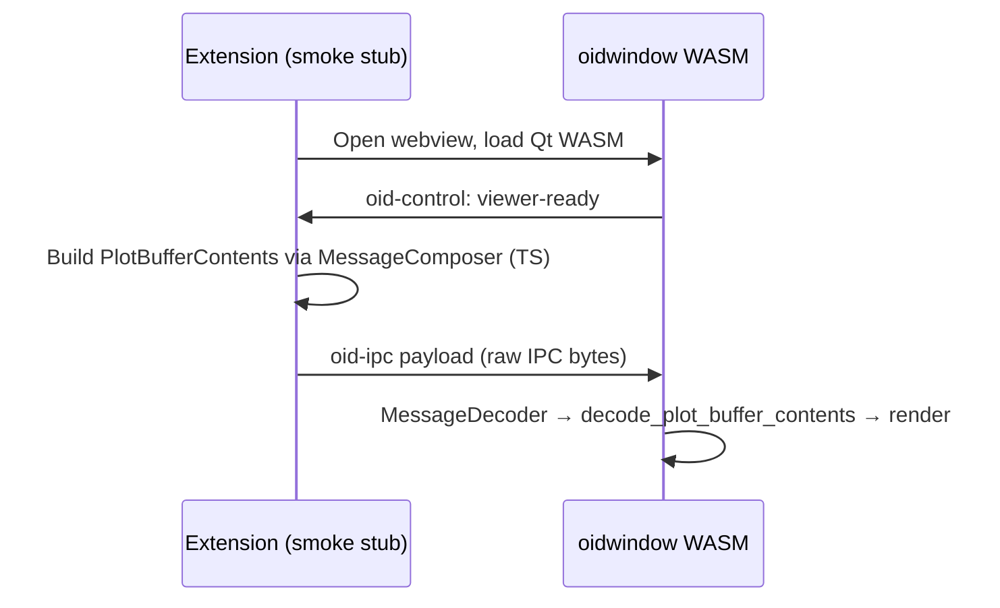

# OID WASM viewer + VS Code extension (Qt 6.11)

**Date:** 2026-06-24  
**Status:** Approved for implementation  
**Supersedes:** `docs/superpowers/plans/2026-06-23-oid-wasm-vscode-design.md` (toolchain, wire format, and first-pass scope)  
**Goal:** Compile `oidwindow` to Qt 6.11 WebAssembly and validate it in a VS Code webview using the **existing custom IPC protocol** (`MessageComposer` / `MessageDecoder`). First pass delivers OID repo P0–P1 plus a minimal extension smoke test.

---

## 1. Decisions

| Topic | Choice |
|-------|--------|
| Qt version | **6.11.x** (desktop + WASM); upgrade to **6.12 LTS** when GA (~Sept 2026) |
| Emscripten | **4.0.7** (required pairing for Qt 6.11 per [Qt WASM docs](https://doc.qt.io/qt-6/wasm.html)) |
| Wire format | **Existing custom binary IPC** — no Protobuf, no OBP |
| Transport | `ITransport` abstraction: `TcpTransport` (desktop) / `PostMessageTransport` (WASM) |
| First-pass scope | OID P0–P1 + extension smoke stub (hardcoded `PlotBufferContents`) |
| Out of scope (this pass) | CodeLLDB DAP bridge, TypeBridge, full parity (P2–P6) |
| WASM artifact | `@openimagedebugger/viewer-wasm` npm package from OID CI |
| Extension repo | Separate `openimagedebugger-vscode` (smoke stub only in this pass) |
| Desktop baseline | Bump entire repo from Qt 6.4.2 → **6.11** |

### Approaches considered

1. **Official Qt 6.11 binary packages (chosen)** — Install desktop Qt 6.11 + `WebAssembly (single-threaded)` via Qt Online Installer or CI cache. Pin `emsdk 4.0.7`. Build with `qt-cmake` from the WASM kit.
2. **Build Qt 6.11 WASM from source in CI** — Rejected: 1–2 hour builds; unnecessary for OID.
3. **Track Qt 6.12 beta now** — Rejected: beta instability; Emscripten pairing not yet documented. Upgrade path documented for 6.12 LTS GA.

---

## 2. Architecture



### Role split

| Component today | WASM + VS Code equivalent | Repo |
|-----------------|---------------------------|------|
| `oidscripts` (Python) | TypeScript extension (future: `codelldb-bridge`) | Extension |
| `oidbridge` (C++) | Extension orchestration (no process spawn) | Extension |
| `oidwindow` (Qt desktop) | `oidwindow` (Qt 6.11 WASM) | OID → npm |
| TCP + `MessageComposer` bytes | Same bytes over `postMessage` | Both |
| GDB/LLDB Python APIs | CodeLLDB DAP (future P2+) | Extension |

Desktop OID (GDB/LLDB Python path) remains unchanged. WASM is an additional build target.

---

## 3. Wire format

### Message types (existing — no changes)

Defined in `src/ipc/message_exchange.h`:

| `MessageType` | Value | Direction |
|---------------|-------|-----------|
| `GetObservedSymbols` | 0 | UI → bridge |
| `GetObservedSymbolsResponse` | 1 | bridge → UI |
| `SetAvailableSymbols` | 2 | bridge → UI |
| `PlotBufferContents` | 3 | bridge → UI |
| `PlotBufferRequest` | 4 | UI → bridge |

`PlotBufferRequest` already exists. No proto or enum additions required.

### Serialization rules

| Field type | On-wire format |
|------------|----------------|
| Primitive (`MessageType`, `int`, `bool`, `BufferType`, `size_t`, …) | `sizeof(T)` raw bytes, platform little-endian |
| `string` | `size_t` length + UTF-8 bytes |
| `deque<string>` / `QStringList` | count + repeated strings |
| Pixel buffer | `size_t` length + raw bytes |

### `PlotBufferContents` field order

Matches `oid_bridge.cpp::plot_buffer`:

1. `variable_name` (string)
2. `display_name` (string)
3. `pixel_layout` (string)
4. `transpose` (bool)
5. `width` (int)
6. `height` (int)
7. `channels` (int)
8. `stride` (int)
9. `buff_type` (`BufferType`)
10. `buffer` (length-prefixed byte span)

Reference tests: `tests/test_message_exchange.cpp`.

### postMessage envelopes

IPC payloads are wrapped for the webview boundary only. The `payload` bytes are **identical** to what `MessageComposer` writes over TCP.

```typescript
// Data plane — same bytes as TCP
interface OidMessage {
  type: 'oid-ipc';
  payload: Uint8Array;
}

// Control plane — not part of MessageComposer stream
interface OidControl {
  type: 'oid-control';
  event: 'viewer-ready';
  version: string;  // OID release version, e.g. "1.0.42"
}
```

Sequencing is not required for P1 (extension → WASM unidirectional smoke test). Add `sequence` later if bidirectional async messaging is needed.

### Large buffers

`postMessage` has practical size limits (~64 MB in Chromium). For P1 smoke test, use a small fixture buffer. Future P2+ should chunk large `PlotBufferContents` payloads or use `SharedArrayBuffer` if needed.

---

## 4. Data flow (first pass)



### Event loop

Desktop polls `oid_run_event_loop` at ~30 Hz for UI→bridge messages. In WASM, inbound `postMessage` events append to `PostMessageTransport`'s receive queue; `MessageHandler::decode_incoming_messages()` drains it. No polling loop in the extension.

---

## 5. OID repo changes

### 5.1 Qt 6.11 baseline (whole repo)

| File | Change |
|------|--------|
| `common.cmake` | `find_package(Qt6 6.11 REQUIRED COMPONENTS Network)` |
| `src/CMakeLists.txt` | `find_package(Qt6 6.11 REQUIRED COMPONENTS Core Gui OpenGL OpenGLWidgets Widgets)` |
| `README.md` | Qt 6.11 install instructions |
| CI workflows | Qt 6.11 images or cached installer |

### 5.2 Transport abstraction (P0)

New `src/ipc/transport.h`:

```cpp
class ITransport {
 public:
  virtual void send(std::span<const std::byte> data) = 0;
  virtual std::size_t receive(std::span<std::byte> dst) = 0;
  virtual bool has_data() const = 0;
  virtual ~ITransport() = default;
};
```

Implementations:

| Class | Platform | Backing |
|-------|----------|---------|
| `TcpTransport` | Desktop | `QTcpSocket` read/write (behavior identical to today) |
| `PostMessageTransport` | Emscripten | JS queue via `EM_ASM` + `window.oidSend` / `window.oidOnMessage` |

Refactor:

- `MessageComposer::send(ITransport*)` — iterate blocks, call `transport->send()` per block (preserves current block-boundary semantics)
- `MessageDecoder` — accept `ITransport&` instead of `QTcpSocket*`; `read_impl` uses `transport.receive()`
- `MessageHandler::Dependencies` — `ITransport& transport` replaces `QTcpSocket& socket`
- `MainWindow` — owns `std::unique_ptr<ITransport>`

Compile definition for WASM: `OID_TRANSPORT_POSTMESSAGE`.

**Not in scope:** `obp_channel`, protobuf, protoc codegen.

### 5.3 WASM build target (P1)

CMake conditional on `CMAKE_SYSTEM_NAME STREQUAL "Emscripten"`:

| Setting | Value |
|---------|-------|
| Qt kit | `wasm-emscripten` (single-threaded) |
| Emscripten | 4.0.7 via `emsdk install 4.0.7 && emsdk activate 4.0.7` |
| Build driver | `qt-cmake` from Qt 6.11 WASM install |
| Entry | `oid_window.cpp` — `__EMSCRIPTEN__`: no TCP connect; emit `viewer-ready` control message |

New files:

| File | Role |
|------|------|
| `src/ipc/tcp_transport.h` / `.cpp` | Desktop adapter |
| `src/ipc/postmessage_transport.h` / `.cpp` | WASM adapter |
| `cmake/EmscriptenWasm.cmake` | `Qt6_DIR` / `EMSDK` validation |
| `wasm/loader.html` | Qt WASM bootstrap + `oidSend`/`oidOnMessage` glue |
| `wasm/package.json` | `@openimagedebugger/viewer-wasm` metadata |
| `.github/workflows/wasm.yml` | emsdk 4.0.7 + Qt 6.11 WASM CI |

npm artifact contents: `oidwindow.wasm`, `oidwindow.js`, Qt runtime files, `loader.html`, `version.json` (OID release version).

### 5.4 WebGL compatibility pass (P1 gate)

`GLCanvas` / `GLTextRenderer` use desktop GL idioms that need GLES/WebGL 2 fixes:

- Replace `GL_FRAMEBUFFER_EXT` → `GL_FRAMEBUFFER`
- Verify FBO creation under WebGL 2
- Confirm mipmap generation or fall back to `GL_NEAREST`
- Skip `find_package(OpenGL 2.1)` for Emscripten builds (Qt provides GLES)

P1 is not complete until WASM loads, receives `PlotBufferContents`, and renders without GL errors.

### 5.5 Qt 6.12 upgrade path

When Qt 6.12.0 LTS ships:

1. Read Emscripten version from [Qt 6.12 Tools and Versions](https://wiki.qt.io/Qt_6.12_Tools_and_Versions) wiki
2. Bump desktop + WASM to Qt 6.12.x
3. Re-pin `emsdk` in CI
4. Re-run desktop regression + WASM smoke

---

## 6. Extension smoke stub (P1+)

Repository: `openimagedebugger-vscode` (new, minimal).

```
openimagedebugger-vscode/
├── package.json              # command: oid.openPanel
├── src/
│   ├── extension.ts          # activate → open webview
│   ├── ipc/
│   │   └── message-exchange.ts   # TS port of MessageComposer
│   └── webview/
│       └── panel.ts          # load loader.html, relay postMessage
├── media/                    # copied from @openimagedebugger/viewer-wasm
└── test/
    └── fixtures/
        └── sample_plot_buffer.bin  # raw IPC bytes from C++ test fixture
```

`message-exchange.ts` must produce byte-identical output to C++ `MessageComposer` for the same logical message. Validate against `tests/test_message_exchange.cpp` fixture bytes.

No DAP, no TypeBridge, no stop handler in this pass.

---

## 7. Error handling

| Failure | Behavior |
|---------|----------|
| WASM fails to load | Webview error panel with OID version and Qt/Emscripten requirements |
| Version mismatch | Warn if extension OID version ≠ `viewer-ready` version; allow smoke test to proceed |
| Malformed IPC payload | `MessageDecoder` throws; log to console; no crash |
| Buffer exceeds postMessage limit | P1 uses small fixture only; chunking deferred to P2+ |
| Debug session ends | N/A in smoke stub |

---

## 8. Testing

| Layer | Test |
|-------|------|
| OID unit | Existing `test_message_exchange.cpp` on `TcpTransport` |
| OID unit | `PostMessageTransport` queue send/receive (`tests/test_transport.cpp`) |
| OID WASM smoke | Playwright: load wasm, send `PlotBufferContents` bytes, assert no GL crash |
| Desktop regression | Full test suite on Qt 6.11 |
| Extension | TS codec byte-matches C++ fixture; webview smoke (manual or Playwright) |

---

## 9. Delivery phases

| Phase | Deliverable | Done when |
|-------|-------------|-----------|
| **P0** | `ITransport` refactor + Qt 6.11 bump | Desktop builds; `test_message_exchange` passes |
| **P1** | WASM build + GL compat + npm artifact | WASM renders test `PlotBufferContents` |
| **P1+** | Extension smoke stub + TS codec | Webview loads artifact; fixture buffer visible |
| P2+ | CodeLLDB bridge, TypeBridge, stop handler | *(future)* |
| P3–P6 | Session management, UI parity, export, ship | *(future — see original design)* |

---

## 10. Success criteria (this pass)

- Desktop OID builds and passes tests on Qt 6.11
- `@openimagedebugger/viewer-wasm` publishes from CI with Qt 6.11 / Emscripten 4.0.7 metadata in `version.json`
- Extension stub loads the artifact and renders a test `PlotBufferContents` message
- Wire format is the existing `MessageComposer` binary protocol — no Protobuf dependency
- Documented upgrade path to Qt 6.12 LTS when GA

---

## Self-review

- **Placeholder scan:** No TBD sections.
- **Internal consistency:** Transport carries existing IPC bytes; no OBP/protobuf references remain. Qt 6.11 + Emscripten 4.0.7 paired throughout. Scope limited to P0–P1+.
- **Scope check:** Single implementation plan for OID repo; extension stub is minimal and separate repo.
- **Ambiguity check:** `PlotBufferContents` field order pinned to `oid_bridge.cpp`. Version compatibility via OID release string, not a separate protocol version field. Chunking for large buffers explicitly deferred to P2+.
