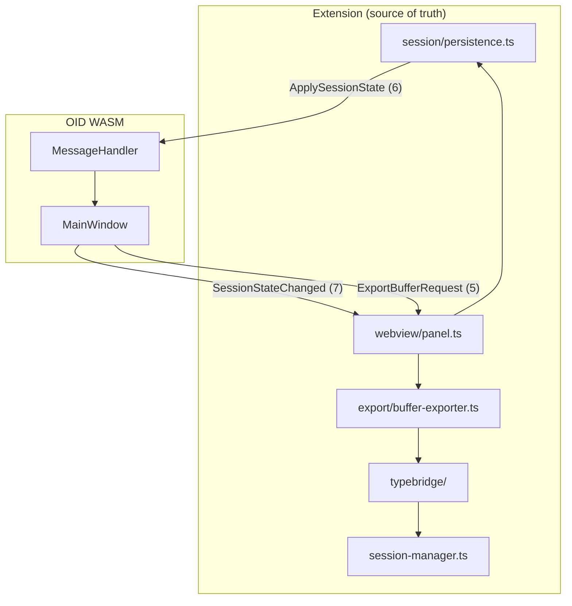

# OID VS Code P5: Export, session persistence, full type parity — Design

**Date:** 2026-06-27  
**Status:** Approved  
**Parent spec:** `docs/superpowers/specs/2026-06-23-oid-wasm-vscode-design.md` (phase P5)  
**Builds on:** P3 session loop, P4 UI parity (WASM viewer), editor-split panel (`2026-06-27-oid-editor-split-view-design.md`), export IPC stub (`2845018` / `0372e75`)

**Goal:** Reach desktop OID parity for export (PNG/Octave), cross-restart session persistence, and all built-in type inspectors plus user-defined custom types — using extended legacy IPC (Approach 1), not OBP migration.

---

## 1. Decisions

| Topic | Choice | Rationale |
|-------|--------|-----------|
| Wire format | **Extend legacy IPC** (types 0–8) | P3 loop already proven; OBP deferred |
| Persistence owner | **Extension** (`globalState` + `workspaceState`) | WASM `QSettings` unreliable |
| Persistence scope | **Full desktop parity** | Watched buffers (1-day expiry), UI prefs, splitter, framerate, export suffix; not window pos/size |
| Export UX | **Hybrid** | WASM context menu + `oid.export` command, shared extension path |
| Export pixels | **Always re-fetch** via DAP at export time | Fresh debugger memory, not WASM texture |
| Export contrast | **From WASM at request time** | 8-float `auto_buffer_contrast_brightness` in IPC; extension applies during PNG encode |
| Types | **Full parity** | Eigen, CvMat, IplImage, pluggable `oid.customTypes` |
| `oid.watchOnStop` | **One-time migration seed** | Merged into persisted watch list on first run; extension list is authoritative thereafter |

### Approaches considered

1. **Extend legacy IPC (chosen)** — add messages 5–8; minimal regression risk.
2. **Full OBP v1** — rejected; large blast radius on working P3 path.
3. **Hybrid wire (legacy + OBP export only)** — rejected; two encoders in one webview.

---

## 2. Architecture



| Concern | Owner |
|---------|-------|
| Watched buffers + UI prefs | Extension storage |
| Restore on viewer ready | `ApplySessionState` after `viewer-ready` |
| Persist UI changes | Debounced `SessionStateChanged` (~100 ms) |
| Export file I/O | Extension (`showSaveDialog` + write) |
| Type parsing | Extension TypeBridge |

**Not persisted on WASM:** window position/size (VS Code owns panel geometry).

**WASM `QSettings`:** disabled under `__EMSCRIPTEN__`; replaced by IPC sync.

---

## 3. Legacy IPC wire format

Extend `MessageType` in `src/ipc/message_exchange.h` and `openimagedebugger-vscode/src/ipc/message-exchange.ts`:

| ID | Name | Direction | Payload |
|----|------|-----------|---------|
| 0–4 | *(existing)* | | |
| 5 | `ExportBufferRequest` | WASM → ext | `string` variableName · `int32` format · `float32[8]` contrastBrightness |
| 6 | `ApplySessionState` | ext → WASM | `string` JSON (UTF-8, u32 length) |
| 7 | `SessionStateChanged` | WASM → ext | `string` JSON (partial or full) |
| 8 | `ExportSelectedBuffer` | ext → WASM | *(empty)* — WASM replies with type 5 for selected list item |

**Format enum** (matches desktop `BufferExporter::OutputType`): `0` = PNG (auto-contrast applied), `1` = Octave raw matrix.

**Note:** Type 5 exists today as variable name only (crash-fix stub). P5 extends the payload with format + contrast; extension must accept both shapes during rollout or bump media atomically.

Add `float` to the C++ `PrimitiveType` concept in `message_exchange.h`.

### Session JSON schema (`version: 1`)

```typescript
interface OidSessionState {
  version: 1;
  rendering: { framerate: number };
  export: { defaultSuffix: string };
  ui: {
    splitterSizes: number[];
    listPosition?: string;
    minmaxVisible: boolean;
    minmaxCompact?: boolean;
    contrastEnabled: boolean;
    linkViewsEnabled: boolean;
    colorspace?: string; // up to 4 chars: b/g/r/a
  };
  buffers: {
    watched: Array<{ name: string; expiresAt: number }>; // unix ms
    removed: string[];
  };
  selectedBuffer?: string;
}
```

- `ApplySessionState`: full snapshot on viewer ready.
- `SessionStateChanged`: partial deep-merge on extension side.

**Storage keys:**

- `globalState` key `oid.session.global`: rendering, export, ui prefs.
- `workspaceState` key `oid.session.workspace`: `buffers` (per-workspace watch list).

---

## 4. Export

### Shared path (`export/buffer-exporter.ts`)

1. Receive export intent (IPC type 5 or `oid.export` → type 8 → type 5).
2. `vscode.window.showSaveDialog` with PNG / Octave filters; default from persisted `export.defaultSuffix`.
3. `CodeLldbBridge.getBufferMetadata(variable, frameId)` — fresh DAP read.
4. Encode file:
   - **PNG:** port `BufferExporter::export_bitmap` in TypeScript (`pngjs`).
   - **Octave:** port `export_binary` (type descriptor + dimensions + raw rows).
5. Apply `contrastBrightness` during PNG encode (same math as `src/io/buffer_exporter.cpp`).
6. Update persisted `defaultSuffix`; show error notification on failure.

### Triggers

| Trigger | Flow |
|---------|------|
| Context menu “Export buffer” | WASM → `ExportBufferRequest` |
| `oid.export` command | ext → `ExportSelectedBuffer` → WASM → `ExportBufferRequest` |

### OID WASM

- `UIEventHandler::export_buffer()` under `__EMSCRIPTEN__`: gather contrast from `Buffer` component, send extended type 5 (no `QFileDialog`).
- `show_context_menu()`: `QMenu::popup()` (never `exec()` on WASM).
- `MessageHandler`: decode type 8, emit export for selected buffer.

Desktop path unchanged (`QFileDialog` + in-process `BufferExporter`).

---

## 5. Session persistence

### Extension `session/persistence.ts`

- `load(context): OidSessionState` — merge global + workspace; apply defaults matching `SettingsConstants` in `settings_manager.h`.
- `save(context, state)` — debounced 100 ms.
- `mergeDelta(state, partial): OidSessionState`.
- `migrateWatchOnStop(state, configNames: string[])` — append config names with fresh 24 h expiry if not present.

### Lifecycle

1. Viewer ready → extension sends `ApplySessionState`.
2. WASM `MessageHandler::decode_apply_session_state()` invokes existing `SettingsApplier` paths (same signals as `SettingsManager::load_*`).
3. User changes UI or watch list → WASM `MainWindow::persist_settings()` under `__EMSCRIPTEN__` serializes callbacks to JSON → `SessionStateChanged`.
4. Extension merges + saves.
5. Watched-buffer expiry: same 1-day semantics as desktop `SettingsManager::persist_settings`.
6. Debug session end disposes panel; **persisted state survives** VS Code restart.

### OID WASM

- `#ifdef __EMSCRIPTEN__` in `MainWindow::persist_settings()`: emit JSON over transport instead of `QSettings`.
- Skip `settings_manager_->load_settings()` on WASM startup; wait for `ApplySessionState`.
- `previous_session_buffers` in WASM still drives auto-plot on `SetAvailableSymbols` (existing behavior).

---

## 6. TypeBridge full parity

### Extension modules

| Module | Python source |
|--------|---------------|
| `typebridge/index.ts` | `typebridge.py` — router, first match wins |
| `typebridge/opencv-mat.ts` | `opencv.Mat` (exists) |
| `typebridge/opencv-cvmat.ts` | `opencv.CvMat` |
| `typebridge/opencv-iplimage.ts` | `opencv.IplImage` |
| `typebridge/eigen-matrix.ts` | `eigen3.EigenXX` |
| `typebridge/custom-type.ts` | workspace `oid.customTypes` |

Refactor `debugger/codelldb-bridge.ts` to delegate to `TypeBridge.resolve(name, typeString, frameId)`.

Custom inspectors run **before** built-ins. Extend `symbol-observable.ts` with custom `typePattern`s.

### `oid.customTypes` (workspace setting)

```json
[{
  "id": "example",
  "typePattern": "^MyImageBuffer$",
  "pointerExpr": "pixels",
  "widthExpr": "width",
  "heightExpr": "height",
  "channels": 1,
  "bufferType": "uint8",
  "strideExpr": "stride",
  "pixelLayout": "rgba",
  "transpose": false
}]
```

Expressions are evaluated as `${variable}.${expr}` via DAP. `bufferType` is one of: `uint8`, `uint16`, `int16`, `int32`, `float32`, `float64`.

### Eigen note

CodeLLDB exposes types via evaluate strings, not Python LLDB `template_argument()`. Port uses evaluate + regex on type name (patterns from `eigen3.py`), with unit tests from recorded LLDB fixture JSON.

---

## 7. Components

### OID repo

| File | Change |
|------|--------|
| `src/ipc/message_exchange.h` | Types 6–8; `float` in `PrimitiveType` |
| `src/ui/messaging/message_handler.cpp` | Decode 6, 8; send 7; extend 5 |
| `src/ui/events/event_handler.cpp` | Extended export IPC; `popup()` on WASM |
| `src/ui/main_window/main_window.cpp` | EMSCRIPTEN persist → IPC; skip QSettings load |
| `tests/test_message_exchange.cpp` | Round-trip for types 5–8 |

### Extension repo

| File | Change |
|------|--------|
| `src/session/persistence.ts` | **new** |
| `src/export/buffer-exporter.ts` | **new** |
| `src/typebridge/*.ts` | extend |
| `src/ipc/message-exchange.ts` | types 6–8 codecs |
| `src/webview/panel.ts` | send 6/8; decode 7; export handler |
| `src/extension.ts` | persistence load on ready; `oid.export` |
| `package.json` | `oid.export` command; `oid.customTypes` schema; add `pngjs` |

---

## 8. Error handling

| Failure | Behavior |
|---------|----------|
| Save dialog cancelled | Silent return |
| Variable not plottable at export | Warning notification; no file written |
| `readMemory` fails | Retry once; then error with variable name |
| Invalid session JSON | Log warning; apply defaults |
| Custom type misconfigured | Warning on plot; skip that inspector |

---

## 9. Testing

### Extension unit tests

- Persistence merge, expiry, removal, watchOnStop migration
- IPC encode/decode types 5–8
- TypeBridge: Mat, CvMat, IplImage, Eigen fixtures, custom type config
- Buffer exporter: PNG + Octave golden samples vs desktop output

### OID unit tests

- `ApplySessionState` JSON → applier invocation (mock deps)
- Export IPC payload includes 8 contrast floats

### Manual matrix

- macOS + Linux, CodeLLDB, each built-in type
- Export PNG + Octave from context menu and `oid.export`
- Restart VS Code → watched buffers + UI toggles restored
- Custom type via workspace config

---

## 10. Success criteria

- User can export a plotted buffer to PNG (with viewer auto-contrast) or Octave from the WASM context menu or `oid.export`.
- Watched buffers and UI preferences persist across VS Code restarts (per workspace for buffer names).
- OpenCV `Mat`, `CvMat`, `IplImage`, and Eigen matrix types plot via the extension TypeBridge.
- User-defined types work via `oid.customTypes` without extension code changes.
- Desktop GDB/LLDB workflow unchanged.

---

## Self-review (spec)

- **Placeholder scan:** No TBD sections.
- **Internal consistency:** IPC types, JSON schema, export re-fetch + contrast-from-WASM, and persistence owner align across sections.
- **Scope check:** Single plan scope; OBP migration explicitly out of scope.
- **Ambiguity check:** Type 5 stub vs extended payload noted; window geometry explicitly excluded from persistence.
