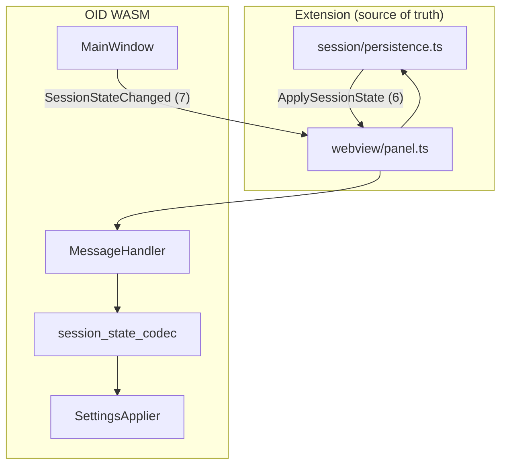
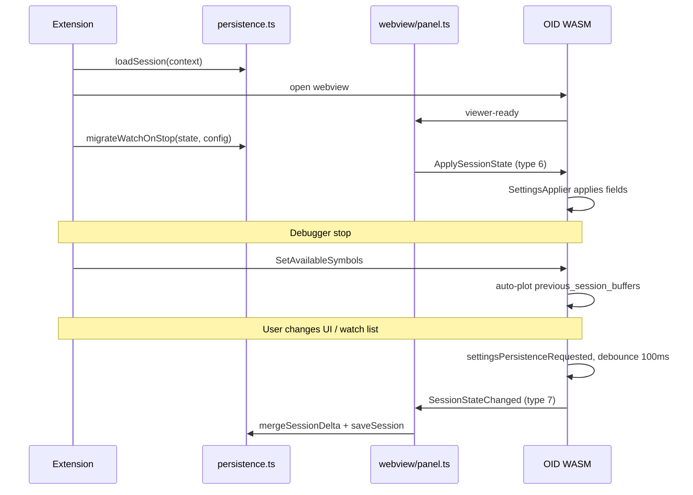

# OID WASM Session Persistence — Design

**Date:** 2026-06-27  
**Status:** Approved (brainstorming)  
**Parent spec:** `docs/superpowers/specs/2026-06-27-oid-vscode-p5-full-parity-design.md` (§5 subset)  
**Related:** P3 session loop (`2026-06-24-oid-vscode-p3-session-design.md`)

**Goal:** Persist OID viewer session state across VS Code restarts with behavioral parity to desktop C++ `SettingsManager`, using extension-owned storage and IPC sync — not a shared QSettings INI file.

---

## 1. Decisions

| Topic | Choice | Rationale |
|-------|--------|-----------|
| Storage owner | **Extension** (`globalState` + `workspaceState`) | QSettings unreliable on WASM; VS Code owns panel geometry |
| Desktop INI sharing | **No** | VS Code session is independent; behavioral parity is sufficient |
| Sync transport | **Legacy IPC types 6–7** | Already declared in `message_exchange.h`; proven P3 wire format |
| C++ apply path | **Reuse `SettingsApplier`** | Same signals as `SettingsManager::load_*`; minimal behavior drift |
| C++ persist path | **Reuse `MainWindow::persist_settings()` callbacks** | Same triggers and 100 ms debounce; only sink changes on WASM |
| Window geometry | **Not persisted** | VS Code owns panel layout |
| Selected buffer | **Not persisted** | Desktop C++ does not restore list selection across restarts |
| Load-only C++ fields | **Persist on WASM** | `listPosition`, `minmaxCompact`, `colorspace` are loaded on desktop but never written back — WASM path persists them |

### Approaches considered

1. **Extension-owned JSON + C++ apply path (chosen)** — behavioral parity, testable, no Qt INI in extension.
2. **Shared QSettings INI with desktop** — rejected; user chose independent VS Code storage.
3. **Emscripten IDBFS + unchanged QSettings** — rejected; QSettings on WASM already unreliable; cross-restart still needs extension bridge.

---

## 2. Architecture



| Concern | Owner |
|---------|-------|
| Watched buffers + UI prefs | Extension storage |
| Restore on viewer ready | `ApplySessionState` after `viewer-ready` |
| Persist UI/buffer changes | Debounced `SessionStateChanged` (~100 ms) |
| Auto-plot on stop | WASM `previous_session_buffers` + existing `SetAvailableSymbols` path |
| Buffer merge algorithm | Extension (port of `SettingsManager::persist_settings`) |

**WASM `QSettings`:** disabled under `__EMSCRIPTEN__` for load and persist; replaced by IPC sync.

---

## 3. Session JSON schema (`version: 1`)

```typescript
interface OidSessionState {
  version: 1;
  rendering: { framerate: number };           // default 60, min 1
  export: { defaultSuffix: string };        // default "Image File (*.png)"
  ui: {
    splitterSizes: number[];
    listPosition?: string;                    // "left" | "right" | "top" | "bottom"
    minmaxVisible: boolean;
    minmaxCompact?: boolean;
    contrastEnabled: boolean;
    linkViewsEnabled: boolean;
    colorspace?: string;                      // up to 4 chars: b/g/r/a
  };
  buffers: {
    watched: Array<{ name: string; expiresAt: number }>;  // unix ms
    removed: string[];                        // transient; cleared after persist
  };
}
```

### C++ field mapping

| JSON path | QSettings key / constant |
|-----------|--------------------------|
| `rendering.framerate` | `Rendering/maximum_framerate` |
| `export.defaultSuffix` | `Export/default_export_suffix` |
| `ui.splitterSizes` | `UI/splitter` |
| `ui.listPosition` | `UI/list_position` |
| `ui.minmaxVisible` | `UI/minmax_visible` |
| `ui.minmaxCompact` | `UI/minmax_compact` |
| `ui.contrastEnabled` | `UI/contrast_enabled` |
| `ui.linkViewsEnabled` | `UI/link_views_enabled` |
| `ui.colorspace` | `UI/colorspace` |
| `buffers.watched` | `PreviousSession/buffers` |

Defaults match `SettingsConstants` in `settings_manager.h`.

### Storage keys

- `globalState` key `oid.session.global`: `rendering`, `export`, `ui`
- `workspaceState` key `oid.session.workspace`: `buffers`

---

## 4. IPC wire format

Types declared in `src/ipc/message_exchange.h` and `openimagedebugger-vscode/src/ipc/message-exchange.ts`:

| ID | Name | Direction | Payload |
|----|------|-----------|---------|
| 6 | `ApplySessionState` | ext → WASM | UTF-8 JSON string (u32 length prefix) |
| 7 | `SessionStateChanged` | WASM → ext | UTF-8 JSON string (partial or full) |

- `ApplySessionState`: full snapshot on viewer ready.
- `SessionStateChanged`: partial deep-merge on extension side before buffer merge.

---

## 5. Buffer semantics

Port of `SettingsManager::persist_settings` buffer logic:

1. Load existing `buffers.watched` from workspace storage.
2. For each stored entry: keep if **not** in `removed`, **not** currently held (from WASM delta), and `expiresAt >= now`.
3. For each currently held buffer: append with `expiresAt = now + 1 day` (`BUFFER_EXPIRATION_DAYS = 1`).
4. Clear `buffers.removed` after persist (matches `clearRemovedBufferNames()` in C++).

On restore:

1. Extension sends non-expired watched names in `ApplySessionState`.
2. WASM `SettingsApplier::apply_previous_session_buffers()` fills `buffer_data.previous_session_buffers`.
3. On `SetAvailableSymbols`, WASM auto-plots matching names (existing `decode_set_available_symbols()` — unchanged).

### `oid.watchOnStop` migration

One-time seed on first viewer ready per debug session: append config names to `watched` with fresh 24 h expiry if not already present. Extension list is authoritative thereafter.

---

## 6. Lifecycle



**Rules:**

1. Skip `settings_manager_->load_settings()` on WASM startup; wait for `ApplySessionState`.
2. Send type 6 only after `viewer-ready`.
3. Persist triggers unchanged from desktop: splitter moved, acEdit/acToggle/linkViewsToggle, buffer add/remove/plot, export suffix change — all via `settingsPersistenceRequested` → 100 ms timer.
4. Debug session end disposes panel; persisted state survives in extension storage.

---

## 7. Components

### OID repo

| File | Change |
|------|--------|
| `src/ui/messaging/session_state_codec.{h,cpp}` | **new** — JSON parse/serialize; invoke `SettingsApplier` on apply |
| `src/ui/messaging/message_handler.cpp` | Decode type 6; helper to send type 7 |
| `src/ui/main_window/main_window.cpp` | EMSCRIPTEN: persist → JSON type 7; skip QSettings load |
| `tests/test_session_state_codec.cpp` | **new** — JSON → applier field mapping |

WASM `persist_settings()` keeps existing `DataCallbacks` lambdas; only the sink differs from `SettingsManager::persist_settings()`.

### Extension repo

| File | Change |
|------|--------|
| `src/session/persistence.ts` | **new** — `loadSession`, `saveSession`, `mergeSessionDelta`, `migrateWatchOnStop` |
| `src/ipc/message-exchange.ts` | Codecs for types 6–7 |
| `src/webview/panel.ts` | Send type 6 on ready; decode type 7 → persistence |
| `src/extension.ts` | Wire lifecycle |
| `test/persistence.test.ts` | **new** — merge, expiry, removed clearing, migration |

---

## 8. Error handling

| Failure | Behavior |
|---------|----------|
| Invalid session JSON on apply | Log warning; apply defaults for missing fields |
| Invalid partial delta on persist | Log warning; ignore unknown keys |
| Expired watched buffers | Filtered on load and merge; never sent to WASM |
| WASM not ready when restore queued | Wait for `viewer-ready` before sending type 6 |

---

## 9. Testing

### Extension unit tests

- Defaults match `SettingsConstants`
- Buffer merge: expiry, removed names, currently-held refresh
- Deep-merge of partial deltas
- `migrateWatchOnStop` one-time seed
- IPC encode/decode types 6–7

### OID unit tests

- `session_state_codec`: JSON fields map to correct `SettingsApplier` invocations
- Colorspace char encoding (`b/g/r/a` ↔ channel names)
- Partial JSON apply does not clobber unspecified fields

### Manual matrix

- Toggle contrast, move splitter, restart VS Code → restored
- Add watched buffer, restart → auto-plotted on next stop when symbol in scope
- Remove buffer → not restored after restart
- Watch list expires after 24 h

---

## 10. Success criteria

- Watched buffers and UI preferences persist across VS Code restarts (workspace-scoped for buffer names).
- Buffer expiry, removed-buffer tracking, and auto-plot behavior match desktop C++.
- Same debounce interval and persist triggers as desktop.
- Desktop GDB/LLDB workflow and QSettings file unchanged.
- No shared INI file between VS Code and desktop OID.

---

## Self-review

- **Placeholder scan:** No TBD sections.
- **Internal consistency:** JSON schema, storage split, IPC types, and C++ apply/persist paths align across sections.
- **Scope check:** Single implementation plan scope; export and TypeBridge remain in parent P5 spec.
- **Ambiguity check:** `selectedBuffer` explicitly excluded; window geometry explicitly excluded; load-only C++ fields explicitly included in WASM persist.
