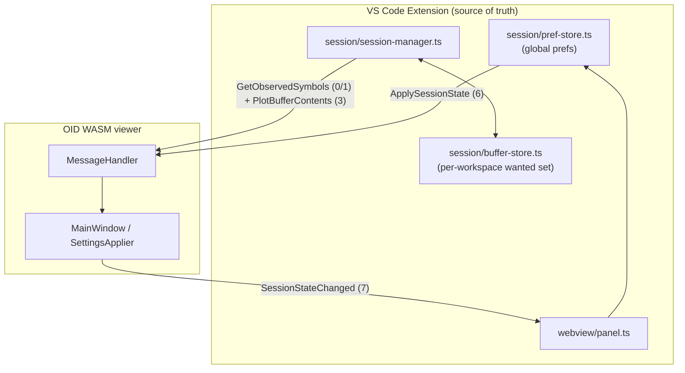

# OID VS Code Persistence Redesign — Design

**Date:** 2026-06-28
**Status:** Approved (brainstorming)
**Supersedes:** `2026-06-27-oid-wasm-session-persistence-design.md`, P5 §5 of `2026-06-27-oid-vscode-p5-full-parity-design.md`
**Related:** P3 session loop (`2026-06-24-oid-vscode-p3-session-design.md`)

**Goal:** Persist OID viewer state across VS Code restarts with **behavioral parity** to the desktop C++ `SettingsManager` — UI preferences and an auto-captured, 1-day-expiring set of plotted buffers that auto-replot when back in scope — while guaranteeing **no regression** to autocompletion or plotting. Clean-slate replacement of the current `persistence.ts`.

---

## 1. Decisions

| Topic | Choice | Rationale |
|-------|--------|-----------|
| Parity meaning | **Behavioral** parity, implementation free to fit the VS Code/WASM split | Desktop QSettings/IDBFS can't satisfy per-workspace or reliable webview storage |
| Storage owner | **Extension** (`globalState` + `workspaceState`) | Reliable, VS Code-managed; enables per-workspace scope |
| Storage scope | **Split:** UI prefs global; buffer set per-workspace | Buffer names belong to a project; prefs are general |
| Auto-replot model | **Auto-capture** plotted buffers with 1-day expiry; `oid.watchOnStop` = one-time seed | Matches desktop `previous_session_buffers` behavior |
| Replot decision owner | **Extension** (never the viewer's `previous_session_buffers`) | Decouples replot from IPC ordering → no auto-plot race |
| Buffer sync | **Existing** IPC only: `GetObservedSymbols` (0/1) + DAP plot (3) | No new IPC, no C++ change for the regression-prone path |
| Pref sync | **New** IPC: `ApplySessionState` (6), `SessionStateChanged` (7) | Prefs live in the viewer UI; need bidirectional sync |
| Buffer removal timing | **Next-stop convergence** via held-set diff (no removal IPC) | Held is monotonic within a session except explicit removal |
| Window geometry | **Not persisted** | VS Code owns panel layout |
| `ui.minmaxCompact` | **Omitted in v1** (no readable runtime state) | Degrades gracefully; follow-up |

### Approaches considered

1. **Split responsibilities (chosen)** — extension owns buffer replot via existing IPC (no C++ change there); UI prefs via new types 6/7. Lowest regression risk; replot independent of IPC ordering.
2. **Unified IPC parity** — both prefs and buffers flow through types 6/7; the viewer's `previous_session_buffers` drives replot like desktop. Rejected: auto-replot then races `SetAvailableSymbols`; larger C++ surface.
3. **WASM-native QSettings via Emscripten IDBFS** — rejected: IndexedDB is per-origin (can't do per-workspace buffers) and webview persistence across restarts is unreliable.

---

## 2. Architecture

The extension is the single source of truth. Two independent subsystems, separate sync mechanisms.



| Concern | Owner | Sync | C++ change |
|---------|-------|------|------------|
| Buffer auto-replot set (per-workspace, 1-day) | `buffer-store` + `session-manager` | existing IPC 0/1 + 3 | **none** |
| UI prefs (global) | `pref-store` | new IPC 6/7 | small, prefs-only |
| Desktop QSettings | unchanged | n/a | none |

**Invariant:** the replot decision is made entirely from the extension's own `wanted` set; it never reads the viewer's `previous_session_buffers`. Therefore `ApplySessionState` timing cannot affect plotting or autocompletion.

---

## 3. Buffer persistence (per-workspace)

Mirrors desktop `previous_session_buffers` semantics with no new IPC and no C++ change.

### State

```ts
type WantedBuffer = { name: string; expiresAt: number }; // unix ms
// workspaceState["oid.session.buffers.v1"] = WantedBuffer[]
```

Held in memory during a session as `Map<name, expiresAt>`, mirrored to `workspaceState` debounced ~100 ms (matches desktop `SETTINGS_PERSIST_DELAY_MS`). Expiry window = 1 day (`BUFFER_EXPIRATION_DAYS = 1`).

### Lifecycle (extends `session-manager`)

1. **Session start:** load persisted set → prune expired → seed in-memory `wanted`. Merge `oid.watchOnStop` names once with fresh expiry (one-time seed; extension set authoritative thereafter).
2. **On each stop** (after the existing replot loop):
   - `held = getObservedSymbols()` (existing IPC 0/1).
   - Replot target = `wanted` ∪ `held`; plot via existing DAP path. Out-of-scope names fail silently, as today.
   - **Refresh:** each name in `held` → `expiresAt = now + 1 day`.
   - **Removal detection:** names present in the previous stop's `held` snapshot but absent now → user closed them → delete from `wanted`. (Held is monotonic within a session except explicit removal — out-of-scope buffers remain held — so the diff is unambiguous.)
   - Persist `wanted` (debounced). Record `prevHeld = held`.
3. **Session end:** no snapshot/diff (held reads empty); the last persisted set is the durable record.

This is desktop's merge algorithm restated: keep unexpired entries not currently held, refresh held with fresh expiry, drop removed.

### Known nuance

A closed buffer is dropped from `wanted` at the **next stop**, not the instant of removal (desktop drops on a 100 ms debounce). The set still converges; only the timing differs. Exact-instant parity would require a small "buffer removed" IPC signal — explicitly out of scope for v1.

---

## 4. UI-pref persistence (global)

Desktop parity for viewer UI settings; the only subsystem touching C++, isolated to prefs.

### Fields

| Field | Source on WASM | Notes |
|-------|----------------|-------|
| `framerate` | direct | drives render timer; default 60, min 1 |
| `export.defaultSuffix` | direct | default `"Image File (*.png)"`; also feeds export dialog default |
| `ui.splitterSizes` | direct | |
| `ui.minmaxVisible` | direct | |
| `ui.contrastEnabled` | direct | |
| `ui.linkViewsEnabled` | direct | |
| `ui.listPosition` | derived | splitter orientation + list child index → `left/right/top/bottom` |
| `ui.colorspace` | derived | `channel_names_` → up-to-4-char `b/g/r/a` string |
| `ui.minmaxCompact` | — | no readable runtime state; **omitted v1**; applier applies `minmaxVisible` alone when absent |

### Flow

- **Restore:** on `viewer-ready`, extension sends `ApplySessionState` (type 6) = full prefs JSON. Viewer parses (`session_state_codec`, `QJsonDocument`) and applies through the **existing `SettingsApplier` slots** — identical code paths to `SettingsManager::load_*`.
- **Persist:** `MainWindow::persist_settings()` under `__EMSCRIPTEN__` serializes prefs (not buffers) and emits `SessionStateChanged` (type 7), reusing the existing 100 ms debounce. Extension deep-merges into `globalState`.
- **C++ change:** skip `settings_manager_->load_settings()` under `__EMSCRIPTEN__` (prefs arrive via type 6). `MessageHandler` gains a null-guarded `SettingsApplier*` dependency to apply type 6. Desktop path unchanged.

The type 6/7 payload is **prefs-only**; buffers are the Section 3 subsystem.

---

## 5. Data model, storage keys & wire format

### Extension storage

```ts
// globalState — UI prefs (all workspaces)
"oid.session.prefs.v1": {
  framerate: number;
  export: { defaultSuffix: string };
  ui: {
    splitterSizes: number[];
    minmaxVisible: boolean;
    contrastEnabled: boolean;
    linkViewsEnabled: boolean;
    listPosition?: string;   // left|right|top|bottom
    colorspace?: string;     // up to 4 chars b/g/r/a
  };
}

// workspaceState — per-workspace buffer set
"oid.session.buffers.v1": Array<{ name: string; expiresAt: number }>;
```

Versioned keys (`.v1`) allow clean future migration. Missing/unknown fields fall back to defaults matching `SettingsConstants`.

### Wire format

Extends the legacy IPC (little-endian u32 headers/lengths; UTF-8 length-prefixed strings).

| ID | Name | Direction | Payload |
|----|------|-----------|---------|
| 6 | `ApplySessionState` | ext → viewer | `string` prefs-JSON |
| 7 | `SessionStateChanged` | viewer → ext | `string` prefs-JSON (partial deep-merged) |

Types 6/7 are already declared in `message_exchange.h` and `message-exchange.ts`.

### Module layout

| Module | Repo | Responsibility |
|--------|------|----------------|
| `src/session/pref-store.ts` | ext | **new** — load/merge/save prefs (globalState), debounce, defaults |
| `src/session/buffer-store.ts` | ext | **new** — `wanted` set: seed, refresh, removal-diff, expiry, persist (workspaceState) |
| `src/session/session-manager.ts` | ext | wire to `buffer-store` (replot ∪ wanted; capture held + diff) |
| `src/webview/panel.ts` | ext | send type 6 on ready; route type 7 → pref-store |
| `src/extension.ts` | ext | lifecycle wiring |
| `src/ipc/message-exchange.ts` | ext | codecs for 6/7 |
| `src/session/persistence.ts` | ext | **removed** — replaced by pref-store + buffer-store |
| `src/ui/messaging/session_state_codec.{h,cpp}` | OID | prefs JSON ↔ `SettingsApplier` (parse + serialize, prefs-only) |
| `src/ui/messaging/message_handler.{h,cpp}` | OID | decode type 6 → applier; null-guarded `SettingsApplier*` dep |
| `src/ui/main_window/main_window.cpp` | OID | `__EMSCRIPTEN__`: persist→type 7, skip QSettings load |

---

## 6. Regression safeguards

| Risk | Mitigation |
|------|------------|
| Autocompletion | Untouched — driven by `available_vars`/`completer_updated` from `SetAvailableSymbols` (IPC 2); no persistence code touches it |
| Auto-plot ordering race | Replot decided extension-side from `wanted`; never reads viewer `previous_session_buffers`; type 6 timing irrelevant |
| Skipping QSettings on WASM | Affects prefs only (now via type 6); `previous_session_buffers` going unused on WASM is fine (replot is extension-driven) |
| Desktop GDB/LLDB | All C++ changes `#ifdef __EMSCRIPTEN__` or null-guarded; desktop QSettings path byte-for-byte unchanged |
| Within-session replot | `session-manager` keeps `getObservedSymbols ∪ watchOnStop`; buffer-store only adds the persisted set and captures held |

---

## 7. Error handling

| Failure | Behavior |
|---------|----------|
| Invalid type-7 JSON | log warning; keep last good prefs |
| Invalid persisted JSON on load | apply defaults |
| Expired buffers | pruned on load; never sent for replot |
| Out-of-scope persisted buffer | plot fails silently (as today) |
| `getObservedSymbols` times out | skip capture/diff this stop; `wanted` unchanged |

---

## 8. Testing

### Extension unit (`node:test`)
- `buffer-store`: expiry prune, held refresh, removal-diff (drop on disappearance), watchOnStop one-time seed, session-start seeding.
- `pref-store`: deep-merge, defaults, debounce.
- IPC codecs: build type 6, decode type 7.

### OID native (`ctest`)
- `session_state_codec`: prefs JSON → applier field mapping (framerate, contrast, colorspace, list position…); serialize round-trip asserts **no buffer keys** present.

### Manual matrix
- Toggle contrast / move splitter → reload window → restored.
- Plot buffers → restart VS Code → auto-replot on next stop when in scope.
- Remove buffer → not back after next stop.
- Watched buffer expires after 24 h.
- Desktop OID QSettings file unchanged after a WASM session.
- Autocomplete and manual plot still work.

---

## 9. Success criteria

- UI prefs persist globally across VS Code restarts.
- Plotted buffers persist per-workspace, auto-replot when in scope, expire after 1 day, and stop returning once removed (by next stop).
- `oid.watchOnStop` still seeds the set on first run.
- Autocompletion and plotting are unchanged in behavior.
- Desktop GDB/LLDB workflow and its QSettings file are untouched.

---

## Self-review

- **Placeholder scan:** none.
- **Internal consistency:** buffer subsystem uses only existing IPC; prefs use 6/7; storage split (global prefs / workspace buffers) consistent across §1–5; `minmaxCompact` omission stated once and reflected in fields + tests.
- **Scope check:** single implementation plan; removal-notification IPC and `minmaxCompact` readback explicitly deferred.
- **Ambiguity check:** "currently held" = `getObservedSymbols()`; removal = held-set diff between stops; replot target = `wanted ∪ held`; type 6/7 payload = prefs-only (no buffer keys).
